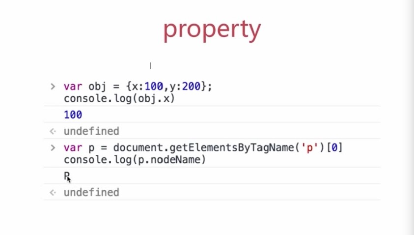
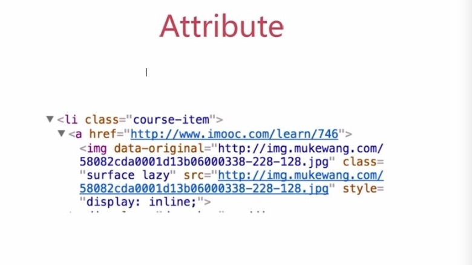

# JS-Web-API

- 常说的JS（浏览器执行的JS）包含两部分
  - JS基础知识（ECMA262标准）
  - JS-Web-API（WC标准）


## DOM 的本质

- DOM可以理解为：

  浏览器把拿到的html代码，结构化一个浏览器能识别并且`js`可操作的一个模型而已。

  ```html
  <!DOCTYPE html>
  <html>
  <head>
      <meta charset="UTF-8">
      <title>Document</title>
  </head>
  <body>
      <div>
         <p>this is p</p> 
      </div>
  </body>
  </html>
  ```


## DOM节点操作

- 获取DOM节点

- 新增节点

- 获取父元素和子元素

- 删除节点

  ``` js
  //获取DOM节点
  var div1 = document.getElementByID('div1')  //元素
  var divList = document.getElementsByTagName('div') //集合
  console.log(divList.length)
  console.log(divList[0])
  
  var containerList = document.getElementsByClassName('.container') //集合
  var pList = document.querySelectorAll('p') //集合
  
  //新增节点
  var div1 = document.getElementById('div1')
  //添加新节点
  var p1 = document.createElement('p')
  p1.innerHTML = 'this is p1'
  div1.appendChild(p1)  //添加新创建的元素
  //移动已有节点
  var p2 = document.getElementById('p2')
  div1.appendChild(p2)
  
  //获取父元素和子元素
  var div1 = document.getElementById('div1')
  var parent = div1.parentElement
  
  var child = div1.childNodes
  div1.removeChild(child[0])
  
  //删除节点
  var div1 = document.getElementById('div1')
  var child = div1.childNodes
  div1.removeChild(child[0])
  ```


## property

- JS对象的一个属性

  ```js
  var pList = document.querySelectorAll('p')
  var p = pList[0]
  console.log(p.style.width)  //获取样式
  p.style.width = '100px' //修改样式
  console.log(p.className) //获取class
  p.className = 'p1'  //修改class
  
  //获取nodeName和nodeType
  console.log(p.nodeName)
  console.log(p.nodeType)
  ```

  <div style="text-align: center"></div>


## attribute

- HTML标签中的属性

  ```js
  var pList = document.querySelectorAll('p')
  var p = pList[0]
  p.getAttribute('data-original')
  p.setAttribute('data-original','www.google.com')
  p.getAttribute('style')
  p.setAttribute('style','font-size:30px;')
  ```

  <div style="text-align: center"></div>

##  “attribute” 和 “property” 之间有什么区别？

- “Attribute” 是在 HTML 中定义的，而 “property” 是在 DOM 上定义的。为了说明区别，假设我们在 HTML 中有一个文本框：`<input type="text" value="Hello">`。

  ```js
  const input = document.querySelector('input');
  console.log(input.getAttribute('value')); // Hello
  console.log(input.value); // Hello
  ```
  ​  但是在文本框中键入“ World!”后:

  ```js
  console.log(input.getAttribute('value')); // Hello
  console.log(input.value); // Hello World!
  ```


## 如何检测浏览器的类型

```js
//navigator
var ua = navigator.userAgent
var isChrome = ua.indexof('Chrome')
console.log(isChrome)
```


## 如何检测屏幕大小

```js
//screen
console.log(screen.width)
console.log(screen.height)
```


## 拆解url的各部分

```js
//location

console.log(location.href) //https://coding.imooc.com/class/180.html?mc_marking=b587280c0c1c0e76c1092aa21406565a&mc_channel=syb6
console.log(location.protocol) //  https
console.log(location.host) //  coding.imooc.com
console.log(location.pathname) // /class/180.html
console.log(location.search) // ?mc_marking=b587280c0c1c0e76c1092aa21406565a&mc_channel=syb6
console.log(location.hash) // undefined
```


## 浏览器历史记录操作

```js
// history
history.back()  //后退
history.forward() //前进
```


## 通用事件绑定

```js
var btn = document.getElementById('btn')
btn.addEventListener('click', function(e) {
    console.log('clicked')
})
function bind(elem, type, fn) {
    elem.addEventListener(type,fn)
}

var a = document.getElementById('link1')
bindEvent(a,'click',function(e) {
    e.preventDefault() //阻止默认行为
    alert('clicked')
})
```


## 事件冒泡

```js
<body>
   <div id="div1">
      <p id="p1">激活</p>
      <p id="p2">取消</p>
      <p id="p3">取消</p>
      <p id="p4">取消</p>
   </div1>
   <div id="div2">
      <p id="p1">取消</p>
      <p id="p1">取消</p>
   </div>
</body>

var p1 = document.getElementById('p1')
var body = document.body
bindEvent(p1,'click',function(e){
    e.stopPropatation() //阻止冒泡
    alert('激活')
})

bindEvent(body,'click',function(e){
    alert('取消')
})
```


## 事件代理

```js
<div id="div1">
    <a href="#">a1</a>
    <a href="#">a2</a>
    <a href="#">a3</a>
    <a href="#">a4</a>
    <!--会随时新增更多a标签-->
</div>

var div1 = document.getElementById('div1')
div1.addEventListener('click',function(e){
    var target = e.target
    if (target.nodeName === 'A') {
        alert(target.innerHtml)
    }
})
```


## 完善通用绑定事件的函数

```js
function bindEvent(elem, type, selector, fn) {
    if(fn == null){
        fn = selector
        selector = null
    }
    elem.addEventListener(type, function(e) {
        var target
        if (selector) {
            target = e.target
            if (target.matches(selector)) {
                fn.call(target,e)
            }
        } else {
            fn(e)
        }
    })
}

//使用代理
var div1 = document.getElementById('div1')
bindEvent(div1, 'click', 'a', function(e) {
    console.log(this.innerHTML)
})
//不使用代理
var a = document.getElementById('a1')
bindEvent(div1, 'click', function (e) {
    console.log(a.innerHTML)
})
```


## 手动编写一个ajax，不依赖第三方库

```js
//XMLHttpRequest
var xhr = new XMLHttpRequest()
xhr.open('GET',"/api",false)
xhr.onreadystatechange = function () {
    //异步执行
    if(xhr.readyState == 4) {
    
        if (xhr.status == 200) {
            alert(xhr.responseText)
        }
    }
}
xhr.send(null)

//readyState状态码说明
0 （未初始化）还没调用send()方法
1 （载入）已调用send()方法
2 （载入完成）send()方法执行完成，已经接收到全部响应内容
3 （交互）正在解析响应内容
4 （完成）响应内容解析完成，可以在客户端调用了
```


## 状态码-Status

- 2xx - 表示成功处理请求。如200
- 3xx - 需要重新定向，浏览器直接跳转
- 4xx - 客户端请求错误，如404
- 5xx - 服务器错误


## 什么是跨域

- 浏览器有同源策略，不允许ajax访问其他域接口
- `Https://www.yourname.com/page1.html`
- `Https://m.imooc.com/course/ajaxcoursecom?cid=459`
- 跨域条件：协议、域名、端口，有一个不同就是跨域


## 可以跨域的三个标签

- ``常用于打点统计，统计网站可能是其他域
- `<link>`、`<script>`可以使用CDN,CDN也是其他域


## 跨域常见的两种方法

- JSONP
  - 借助第三方[JSONP插件](https://github.com/webmodules/jsonp)
- 服务端设置header
  - header('Access-Control-Allow-Origin:*')   允许所有来源访问
  - header('Access-Control-Allow-Method:POST,GET')    允许访问的方式


## JSONP实现跨域原理

- 加载`http://coding.m.imooc.com/classindex.html`
- 不一定服务器真正有一个classindex.html文件
- 服务器可以根据请求，动态生成一个文件，返回
- 同理于`<script src="http://coding.m.imooc.com/api.js">`

```js
<script>
   //跨域请求成功的回掉函数
   window.callback = function (data) {
       //这是跨越得到的信息
       console.log(data)
   }
</script>
<script src="http://coding.m.imooc.com/api.js></script>
```


### document 中的`load`事件和`DOMContentLoaded`事件之间的区别是什么？

当初始的 HTML 文档被完全加载和解析完成之后，`DOMContentLoaded`事件被触发，而无需等待样式表、图像和子框架的完成加载。

`window`的`load`事件仅在 DOM 和所有相关资源全部完成加载后才会触发。


### 请描述`cookie`、`sessionStorage`和`localStorage`的区别

上面提到的技术名词，都是在客户端以键值对存储的存储机制，并且只能将值存储为字符串。

|                                                    | `cookie`                                           | `localStorage` | `sessionStorage` |
| -------------------------------------------------- | -------------------------------------------------- | -------------- | ---------------- |
| 由谁初始化                                         | 客户端或服务器，服务器可以使用`Set-Cookie`请求头。 | 客户端         | 客户端           |
| 过期时间                                           | 手动设置                                           | 永不过期       | 当前页面关闭时   |
| 在当前浏览器会话（browser sessions）中是否保持不变 | 取决于是否设置了过期时间                           | 是             | 否               |
| 是否随着每个 HTTP 请求发送给服务器                 | 是，Cookies 会通过`Cookie`请求头，自动发送给服务器 | 否             | 否               |
| 容量（每个域名）                                   | 4kb                                                | 5MB            | 5MB              |
| 访问权限                                           | 任意窗口                                           | 任意窗口       | 当前页面窗口     |