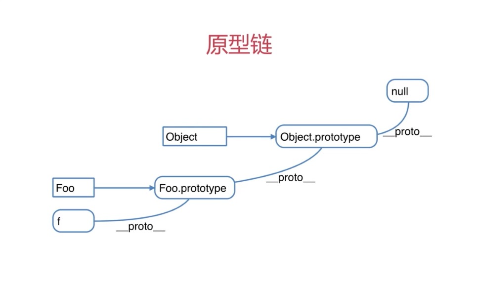

# 原型和原型链

## 构造函数

`new`一个对象的过程:

1. 创建一个新的对象
2. this指向这个新对象
3. 执行代码，即对this赋值
4. 返回this

```js
function Foo(name, age) {
    this.name = name
    this.age = age
    this.class = "class-1"
    //return this   //默认有这一行
}
var f = new Foo('zhangshan',20)
var f1 = new Foo('lisi',22)  //创建多个对象
```

`new`一个对象的过程

## 构造函数-扩展

1. var a = {} 其实是var a = new Object()的语法糖
2. var a = [] 其实是var a = new Arrayt()的语法糖  //推荐var a={},a=[]这种写法，可读性高，执行效率高
3. function Foo() {...}  其实是var Foo = new Function(...)
4. 使用instanceof判断一个函数是否是另一个变量的构造函数

## 原型规则

1. 所有的引用类型（数组、对象、函数），都有一个`__proto__（隐式原型）`属性,属性值是一个普通的对象

2. 所有的函数，都有一个`prototype（显式原型）`属性，属性值也是一个普通的对象(对象里面的值是一个构造函数)

3. 所有的引用类型（数组、对象、函数），都有一个`__proto__（隐式原型）`属性值指向它的构造函数的`prototype`属性值
4. 当试图得到一个对象的某个属性时，如果这个对象本身没有这个属性，那么回去它的`__proto__`(即它的构造函数的prototype)中寻找

```js
var obj = {}; obj.a = 100;
var arr = []; arr.a = 100;
var fn = function () {}
fn.a = 100;

console.log(obj.__proto__) //{constructor: ƒ, __defineGetter__: ƒ, __defineSetter__: ƒ, hasOwnProperty: ƒ, __lookupGetter__: ƒ, …}  
console.log(arr.obj.__proto__) //{constructor: ƒ, __defineGetter__: ƒ, __defineSetter__: ƒ, hasOwnProperty: ƒ, __lookupGetter__: ƒ, …}
console.log(fn.obj.__proto__) //{constructor: ƒ, __defineGetter__: ƒ, __defineSetter__: ƒ, hasOwnProperty: ƒ, __lookupGetter__: ƒ, …}

console.log(fn.prototype)  // {constructor: ƒ}

console.log(obj.__proto__ === Object.prototype) //true
```

## 原型链

```js
//构造函数
function Foo(name, age) {
    this.name = name
}
Foo.prototype.alertName = function () {
    alert(this.name)
}
//创建实例
var f = new Foo('zhangshan')
f.printName = function () {
    console.log(this.name)
}
//测试
f.printName()  //'zhangshan'
f.alertName()  //'zhangshan'
f.toString() //要去f.__proto__.proto__中查找

//循环对象自身的属性
var item
for (item in f) {
    //高级浏览器已经在for in中屏蔽了来自原型的属性
    // 但是这里建议大家还是加上这个判断，保证程序的健壮性
    if (f.hasOwnProperty(item)) {
        console.log(item)
    }
}
```

<div style="text-align: center"></div>

## 原型链继承-封装DOM查询例子

```js
function Elem(id) {
    this.elem = document.getElementById(id)
}

Elem.prototype.html = function (val) {
    var elem = this.elem
    if(val) {
        elem.innerHtml = val
        return this  //链式操作
    } else {
        return elem.innerHtml
    }
}

Elem.prototype.on = function (type, fn) {
    var elem = this.elem
    elem.addEventListener(type, fn)
    return this //链式操作
}
var div1 = new Elem('div1')
// console.log(div1.html())
div1.html('<p>hello</p>').on('click', function () {
    alert('clicked')
}).html('<p>javascript</P>')
```
