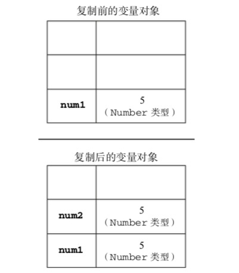
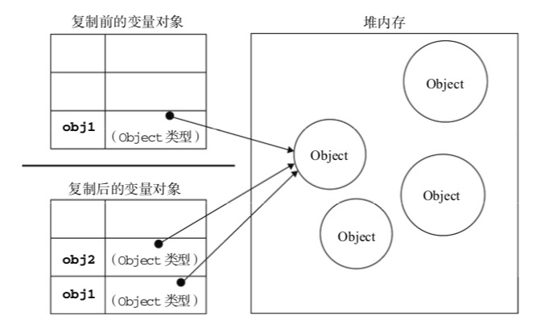

# 变量

按存储方式区分：JS 变量类型分为`值类型`和`引用类型`

## 值类型

`字符串（string`）、`数值（number）`、`布尔值（boolean）`、`undefined`

1. 占用空间固定，保存在栈中（当一个方法执行时，每个方法都会建立自己的内存栈，在这个方法内定义的变量将会逐个放入这块栈内存里，随着方法的执行结束，这个方法的内存栈也将自然销毁了。因此，所有在方法中定义的变量都是放在栈内存中的；栈中存储的是基础变量以及一些对象的引用变量，`基础变量的值是存储在栈中`，而引用变量存储在栈中的是`指向堆中的数组或者对象的地址`，这就是为何修改引用类型总会影响到其他指向这个地址的引用变量。）<div style="text-align: center"></div>
2. 保存与复制的是值本身（深拷贝）
3. 可以使用 typeof 检测的数据类型（包括 function）
4. 基本类型数据是值类型

```js
1. var a = 100
2. var b = a
3. a = 200
4. console.log(b) // 100
```

## 引用类型

`对象（object）`、`数组（array）`、`函数（function）`

1. 占用空间不固定，保存在堆中（当我们在程序中创建一个对象时，这个对象将被保存到运行时数据区中，以便反复利用（因为对象的创建成本通常较大），这个运行时数据区就是堆内存。堆内存中的对象不会随方法的结束而销毁，即使方法结束后，这个对象还可能被另一个引用变量所引用（方法的参数传递时很常见），则这个对象`依然不会被销毁`，只有当一个对象没有任何引用变量引用它时，系统的垃圾回收机制才会在核实的时候回收它。）<div style="text-align: center"></div>
2. 保存与复制的是指向对象的一个指针（浅拷贝）
3. 可以使用 instanceof 检测的数据类型 （也可以用来判断一个函数是否是另一个变量的构造函数）
4. 使用 new()方法构造出的对象是引用型

```js
var a = { age: 20 }
var b = a
b.age = 20
console.log(a.age) // 20

// 浅拷贝
var c = { age: 20 }
var d = { ...c }
d.age = 30
console.log(c) // 20
console.log(d) // 30

// 如果是嵌套的引用对象，那么浅拷贝将失效
var c = { age: { a: 20 } }
var d = { ...c }
d.age.a = 30
console.log(c.age.a) // 30
console.log(d.age.a) // 30

// 深拷贝 借用JSON对象的parse和stringify
var c = { age: { a: 20 } }
var d = JSON.parse(JSON.stringify(c))
d.age.a = 30
console.log(c.age.a) // 20
console.log(d.age.a) // 30
// 但是要注意JSON无法序列化function、undefined、symbol、循环引用，目前为止，JS无法做到完美的深拷贝
```

## typeof 运算符

`typeof`只能用来判断`值类型`和`引用类型`中的`function`

```js
1. typeof undefined // undefined
2. typeof 'abc' // string
3. typeof 123 // number
4. typeof true // boolean
5. // typeof 区分不出来引用类型（除了函数）
6. typeof {} // object
7. typeof [] // object
8. typeof null // object
9. typeof console.log //function
```

## instanceof 运算符

```js
var a = [1, 2, 3]
console.log(a instanceof Array) //true
var b = { age: 20 }
console.log(b instanceof Object) //true
function Foo() {}
var f = new Foo()
console.log(f instanceof Foo) //true
```

`f instanceof Foo`的判断逻辑是：

`f`的`__proto__`一层一层往上，能否对应到 Foo.prototype，再试着判断`f instanceof Foo`

## 变量计算-强制类型转换

1. 字符串拼接

```js
var a = 100 + 10 //110
var b = 100 + '10' // '10010'
```

2. == 运算符

```js 
100 == '100' //true
0 == '' //true
null == undefined //true
```

3. if 语句

```js
var a = true
if (a) {
  console.log(a) //true
}
var b = 100
if (b) {
  console.log(b) //100
}
var c = ''
if (c) {
  console.log(100) // 进不去if里面
}
```

4. 逻辑运算

```js
console.log(100 && 0) // 0
console.log('' || 'abc') //'abc'
console.log(!window.abc) // true

//判断一个变量会被当作true还是false
var a = 100
console.log(!!a) //true
```

## 如何理解 JSON？

JSON 只不过是一个 JS 对象而已

```js
JSON.string({ a: 10, b: 20 }) //JSON转换成字符串
JSOn.parse('{a:10,b:20}') //字符串转换成JSON
```

## 何时用 === 何时用 ==

```js
if (obj.a == null) {
  //这里相当于obj.a === null || obj.a === undefined 的简写形式
  //jquery源码中推荐的写法
}
```
