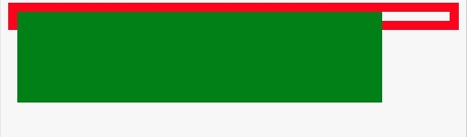
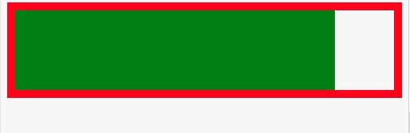
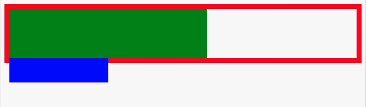
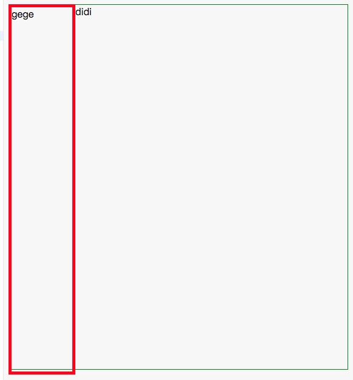
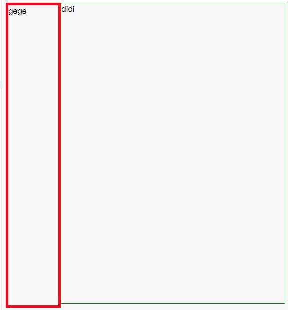

## 基本概念

`块格式化上下文（Block Formatting Context，BFC）` 是 Web 页面的可视化 CSS 渲染的一部分，是布局过程中生成块级盒子的区域，也是浮动元素与其他元素的交互限定区域。

下列方式会创建块格式化上下文：

- 根元素或包含根元素的元素
- 浮动元素（元素的 float 不是 none）
- 绝对定位元素（元素的 position 为 absolute 或 fixed）
- 行内块元素（元素的 display 为 inline-block）
- 表格单元格（元素的 display 为 table-cell，HTML 表格单元格默认为该值）
- 表格标题（元素的 display 为 table-caption，HTML 表格标题默认为该值）
- 匿名表格单元格元素（元素的 display 为 table、table-row、 table-row-group、
- table-header-group、table-footer-group（分别是 HTML table、row、tbody、thead、tfoot 的默认属性）或 inline-table）
- overflow 值不为 visible 的块元素
- display 值为 flow-root 的元素
- contain 值为 layout、content 或 strict 的元素
- 弹性元素（display 为 flex 或 inline-flex 元素的直接子元素）
- 网格元素（display 为 grid 或 inline-grid 元素的直接子元素）
- 多列容器（元素的 column-count 或 column-width 不为 auto，包括 column-count 为 1）
  column-span 为 all 的元素始终会创建一个新的 BFC，即使该元素没有包裹在一个多列容器中（标准变更，Chrome bug）。

## BFC 使用场景-爸爸管儿子

用 BFC 包住浮动元素。(这不是清除浮动，clearfix 才是用来清除浮动)[在线编辑](http://js.jirengu.com/rarab/2/edit)

```html
<style>
  .parent {
    border: 10px solid red;
    min-height: 10px;
  }
  .child {
    height: 100px;
    background: green;
    width: 400px;
    float: left;
  }
  .clearfix::after {
    content: '';
    display: block;
    clear: both;
  }
</style>
<div class="parent"><div class="child"></div></div>
```

当子元素浮动的时候，父元素会出现坍塌的情况：


</img-wrapper>
当我们给父元素加上`display:inline-block;`的时候，这时候父元素触发了 BFC,能把子元素给包裹住(类似清除浮动)


</img-wrapper>
按照 BFC 基本概念的定义，只要我们给父元素加上`position:absolute;overflow:hidden;`等等，只要触发了父元素的 BFC,不管子元素如何浮动，都能被父元素包裹住，也就是说 BFC 会触发父元素重新计算自身的高度,但是不会影响内部元素。
:::tip
如果只是为了触发父元素的 BFC,推荐用`display:flow-root;`这样不会给父元素带来额外的属性，不过需要考虑该属性的兼容性
:::
:::tip
在触发了 BFC 的父元素内部，子元素之间的 margin 会合并
:::

还需要注意的是，父元素只能包裹子元素，不能包裹孙子元素：

```html
<style>
    .parent{
    border:10px solid red;
    min-height:10px;
    display:flow-root;
  }
  .child{
    height:100px;
    background:green;
    width:400px;
    float:left;
  }
  .sunzi{
    height:50px;
    width:200px;
    background:blue;
    margin-top:100px;
  }
  .clearfix::after{
    content: '';
    display:block;
    clear:both;
  }
  <div class="parent">
    <div class="child">
      <div class="sunzi"></div>
    </div>
  </div>
</style>
```



</img-wrapper>

这里为了演示效果，把`child`的高度写死了，如果把`child`的`height:100px;`去掉，child 就能包裹住`sunzi`元素,因为`child`有`float:left;`属性，所以作为父元素它本身也触发了 BFC,可以包裹住浮动的子元素。

## BFC 使用场景-兄弟元素之间划清界限

[在线编辑](http://js.jirengu.com/fetew/1/edit)

```html
<style>
   .gege{
    width:100px;
    min-height:600px;
    border:5px solid red;
    float:left;
  }
  .didi{
    min-height:600px;
    border:1px solid green;
  }
   <div class="gege">gege</div>
    <div class="didi">didi</div>
</style>
```



</img-wrapper>

从图中可以看出，`gege`和`didi`有部分元素重叠了，这时候我们给`didi`加上`display:flow-root;`触发 BFC,再看看效果：


</img-wrapper>
重叠的部分就分开了，也是就是说利用 BFC 可以做一个两栏的自适应页面，左边宽度固定，右边自适应。
