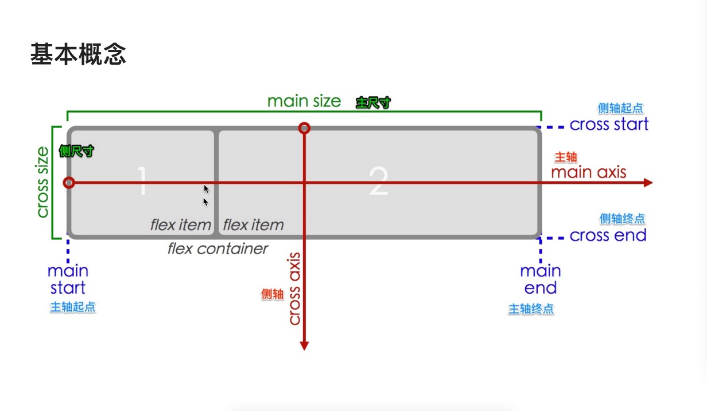
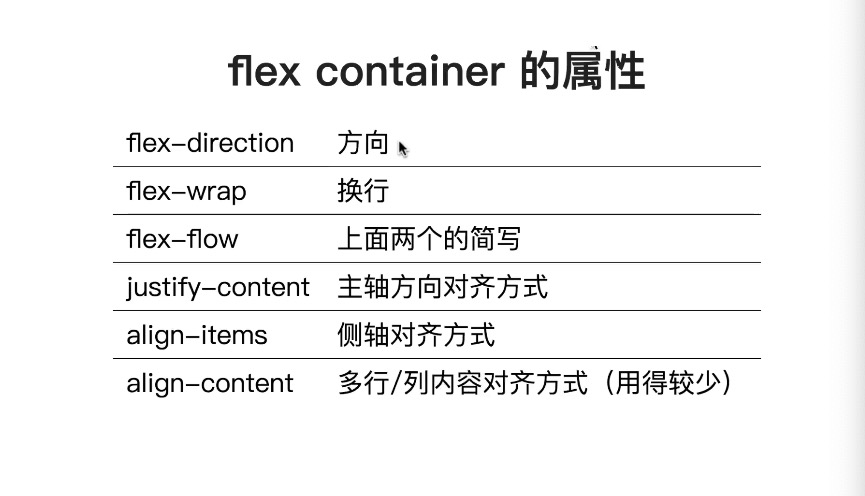
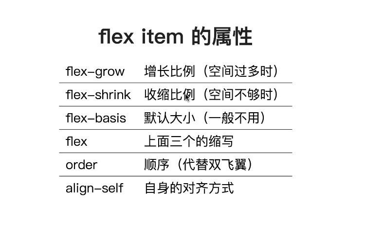
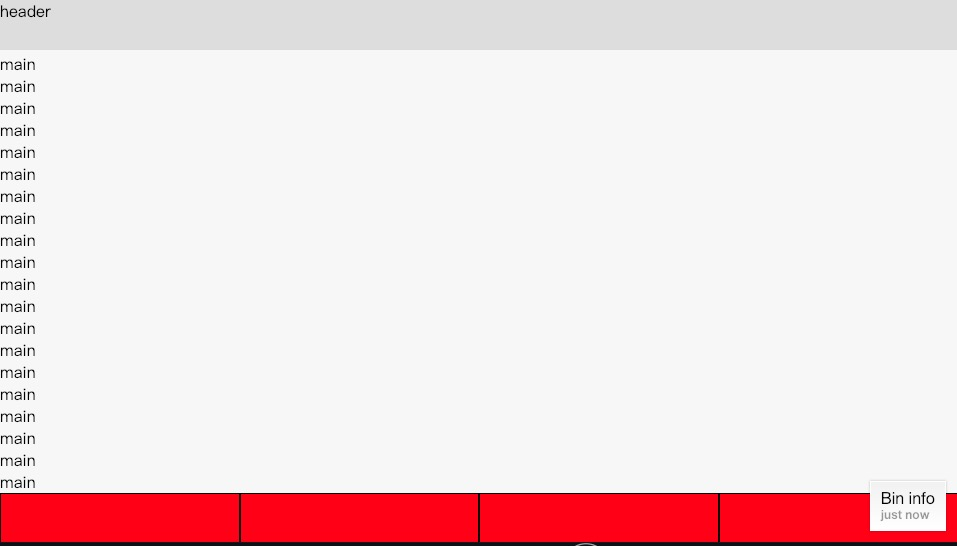
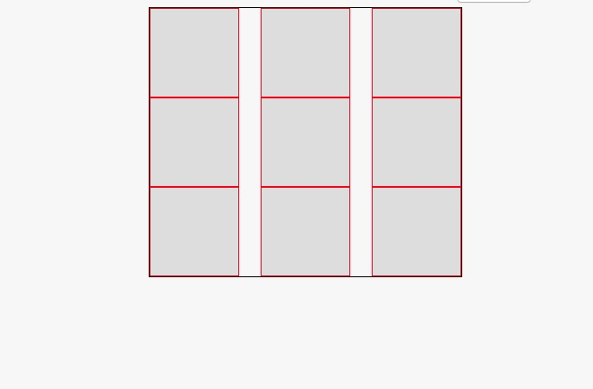
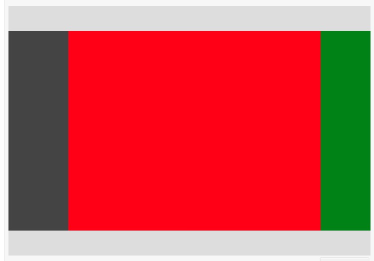

## 基本概念



</img-wrapper>



</img-wrapper>



</img-wrapper>

## 上中下布局 中间自适应

[在线编辑](http://js.jirengu.com/xoyog/1/edit?html,output)

```html
<style>
    *{
      margin:0;
      padding:0;
      box-sizing:border-box;
    }
     ul{list-style:none;}
    .container{
      height:100vh;
      display:flex;
      flex-direction: column;
    }
    header{
      min-height:50px;
      background:#ddd;
    }
    main {
      flex-grow:1;
      overflow:auto;
    }
    footer > ul {
      height:50px;
      display: flex;
    }
    footer > ul > li {
      background:red;
      width:25%;
      height:100%;
      border:1px solid black;
    }
  </style>
</head>
<body>
  <div class="container">
    <header>header</header>
    <main>
      <p>main</p>
       省略
      <p>main</p>
    </main>
    <footer>
      <ul>
        <li></li>
        <li></li>
        <li></li>
        <li></li>
      </ul>
    </footer>
  </div>
</body>
```



</img-wrapper>

## 产品列表布局

[在线编辑](http://js.jirengu.com/yazut/1/edit?html,output)

```html
 <style>
    *{margin:0;padding:0;box-sizing:border-box;}
    ul{list-style:none;}

    ul{
      display:flex;
      flex-wrap:wrap;
      width:350px;
      margin:auto;
      border:1px solid black;
      justify-content:space-between;
    }
    li {
      width:100px;
      height:100px;
      background:#ddd;
      border:1px solid red;
    }
  </style>
</head>
<body>
  <ul>
    <li></li>
    <li></li>
    <li></li>
    <li></li>
    <li></li>
    <li></li>
    <li></li>
    <li></li>
    <li></li>
  </ul>
</body>
```



</img-wrapper>

## 双飞翼布局

[在线编辑](http://js.jirengu.com/yazut/1/edit?html,output)

```html
<style>
   header{
     height:50px;background:#ddd;
   }
    footer{
      height:50px;background:#ddd;
    }
    .content{
      display:flex;
    }
    .content > aside {
      width:120px;
      background: #444;
    }
    .content main {
      height:400px;
      flex-grow:1;
      background:red;
    }
    .content > nav {
      width:100px;
      background:green;
    }
  </style>
</head>
<body>
  <header></header>
  <div class="content">
    <aside></aside>
    <main></main>
    <nav></nav>
  </div>
  <footer></footer>
</body>
```



</img-wrapper>
