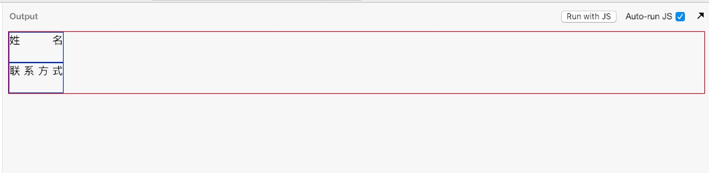
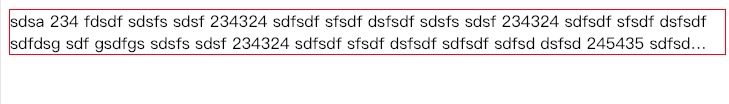
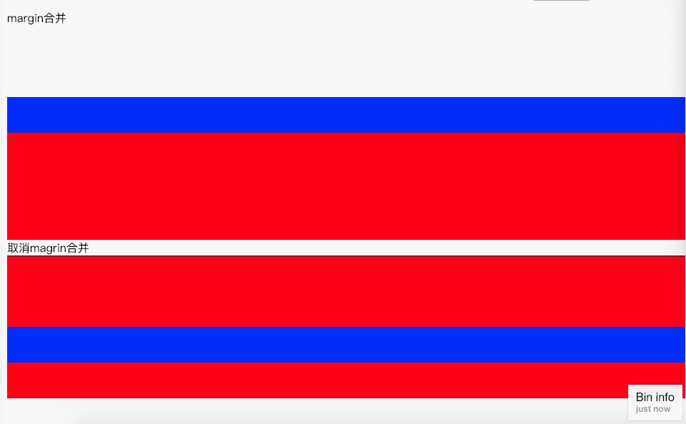
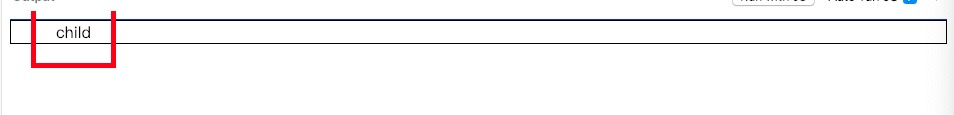
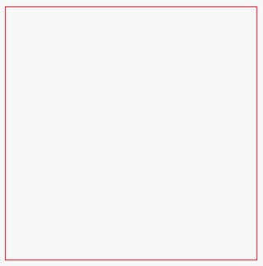

## 多行文字两端对齐

利用`text-align: justify`多行文字两端对齐的特性，再用伪元素`after`伪造成多行，便可以达到两个单行文字两端对齐的效果。代码及效果图如下：[在线编辑](http://js.jirengu.com/yedod/1/edit?html,output)

```html
  <style>
    div {
      border: 1px solid red;
    }
    span {
      display:inline-block;
      width:5em;
      text-align:justify;
      border:1px solid blue;
    }
    span::after{
      content: '';
      display:inline-block;
      width:100%;
    }
  </style>
</head>
<body>
  <div>
    <span>姓名</span> <br>
    <span>联系方式</span>
  </div>
</body>
```



</img-wrapper>

## 多行行文字溢出显示省略号

`-webkit-line-clamp`可控制在第几行开始显示省略号，代码及效果图如下：[在线编辑](http://js.jirengu.com/gerex/2/edit?html,output)

```html
<style>
  div {
    border: 1px solid red;
    display: -webkit-box;
    -webkit-line-clamp: 3;
    -webkit-box-orient: vertical;
    overflow: hidden;
  }
</style>
<body>
  <div>
    sdsa 234 fdsdf sdsfs sdsf 234324 sdfsdf sfsdf dsfsdf sdfdsg sdf gsdfgs
    sdfsdf sdfsd dsfsd 245435 sdfsd sdfsdf 232b 32432 43543
  </div>
</body>
```



</img-wrapper>

## margin 合并

当我们在子元素里加上`margin-top、margin-bottom`样式时，父元素有可能也会继承该样式的效果：[在线编辑](http://js.jirengu.com/wohad/2/edit?html,output)

```html
<style>
  .inheritParent {
    background: red;
    height: 200px;
  }
  .child {
    background: blue;
    height: 50px;
    margin-top: 100px;
  }
  .parent {
    background: red;
    height: 200px;
    border-top: 1px solid; // overflow:hidden padding-top也可以
  }
</style>
<body>
  margin合并
  <div class="inheritParent"><div class="child"></div></div>
  取消magrin合并
  <div class="parent"><div class="child"></div></div>
</body>
```



</img-wrapper>

解决该问题的办法是给父元素加上`border`、`padding`或者`overflow:hidden`。

## 内联元素宽高(span)如何影响父元素(块级元素 div)的宽高

内联元素的宽度跟内容的宽度、margin、padding、border 有关，这些样式都会撑开父元素的宽度；但是高度只跟行高(不同的字体，行高不一样)有关，margin、padding、border 不会撑开父元素的高度;代码及效果图如下：[在线编辑](http://js.jirengu.com/vujep/1/edit?html,output)

```html
<style>
    body {
      border-top:1px solid blue;
    }
    span {
      border:5px solid red;
      padding:20px;
      margin:20px;
    }
    div {
      border: 1px solid black;
    }
  </style>
</head>
<body>
  <div>
    <span class="child">child</span>
  </div>
</body>
```



</img-wrapper>

## 画宽高 1:1 的 div

[在线编辑](http://js.jirengu.com/yocut/1/edit?html,output)

```html
  <style>
    .same {
      padding-top: 100%;
      border:1px solid red;
    }
  </style>
</head>
<body>
  <div class="same"></div>
</body>
```



</img-wrapper>

在图片还没完全加载完的时候，可以利用`padding-top:100%`来进行图片占位。
