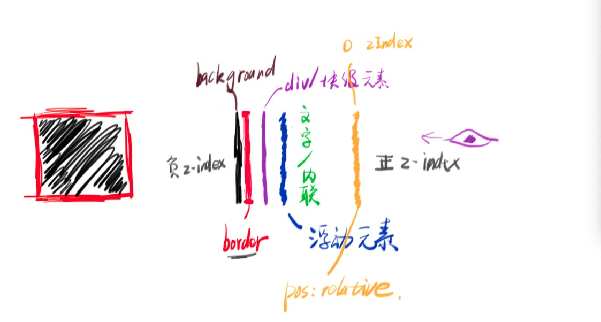
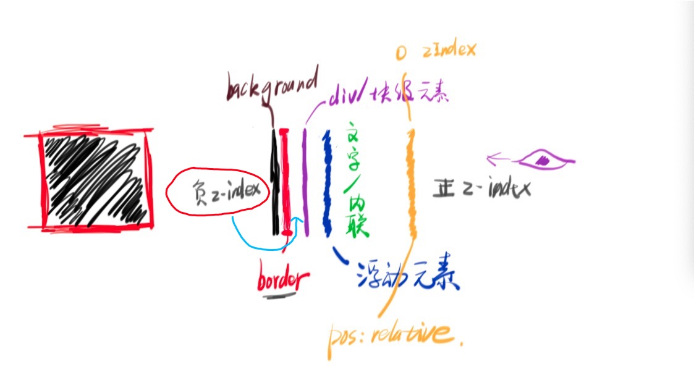

## 堆叠顺序

网页是有图层的，也就涉及到了图层堆叠(显示)的顺序：

- 堆叠顺序
  1. background
  2. border
  3. 块级
  4. 浮动
  5. 内联
  6. z-index: 0
  7. z-index: +

如果是兄弟元素重叠，那么后面的盖在前面的身上；数字大的层级会盖住数字小的层级，如下图所示：(最右边表示人眼方向，比如`z-index:1`是人眼最先看到的层级)

</img-wrapper>

:::tip
上图是在元素在没有触发堆叠上下文，图层的显示情况；一旦触发了堆叠上下文，`z-index:负数`位置会发生改变。
:::

## 堆叠上下文

堆叠上下文可以理解为堆叠作用域，跟 BFC 一样，我们只知道一些属性会触发堆叠上下文，但并不知道堆叠上下文具体是什么。以下属性会触发堆叠上下文：

- 堆叠上下文
  1. z-index 值不为 auto 的 flex 项(父元素 display:flex | inline-flex)
  2. 元素的透明度 opacity 值不等于 1
  3. 元素的变形 transform 不是 none
  4. 元素的 mix-blend-mode 值不是 normal
  5. 元素的 filter 值不是 none
  6. 元素的 isolation 值是 isolate
  7. will-change 指定的属性值为上面的任意一个
  8. 元素的-webkit-overflow-scrolling 设置为 touch
  9. 元素的 mask 属性不是 none
  10. 根元素 HTML

比如，给父元素设置了`position:relative;z-index:0;`,那么这个父元素所有的子元素，不管`z-index`设置的是多少(负数和正数)，所有子元素的图层都会在父元素的`border`层上方；也就是说一旦一个元素触发了上下文，就会形成一个自己的图层作用域，该元素所有的后代元素，都将显示在该元素的上方。根元素`HTML`就是最底层的触发了上下文的元素。

</img-wrapper>
