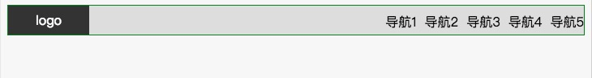
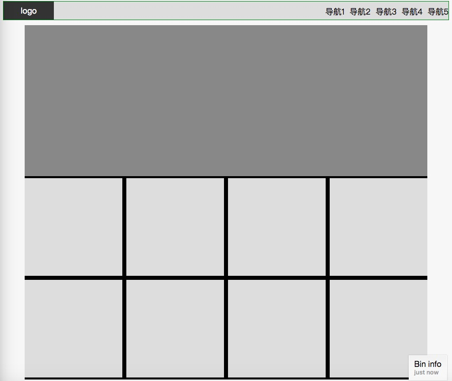
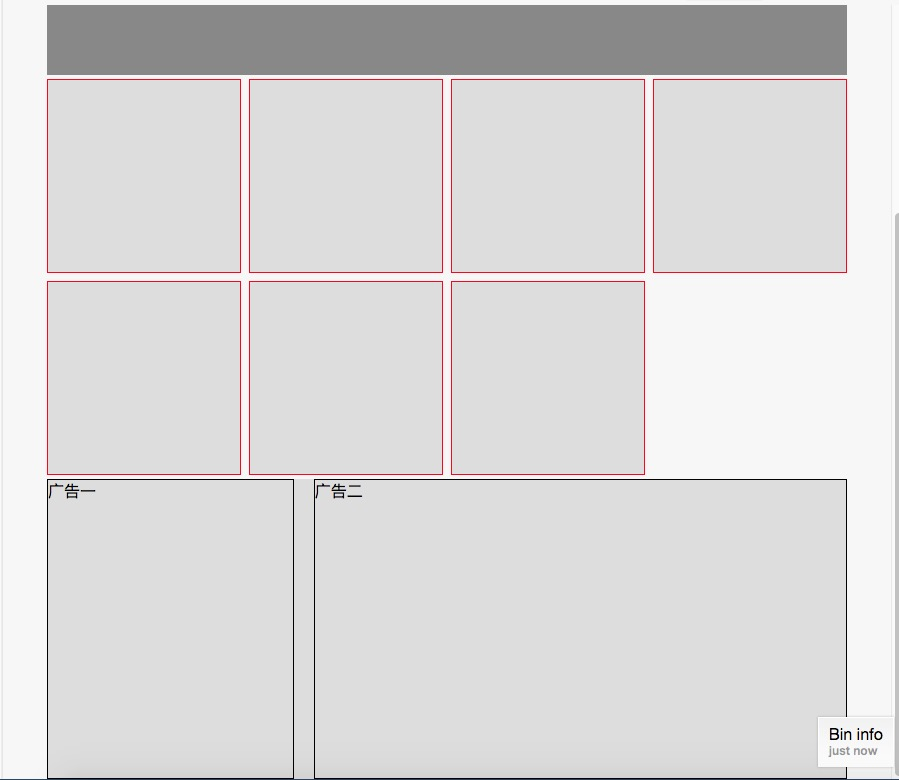
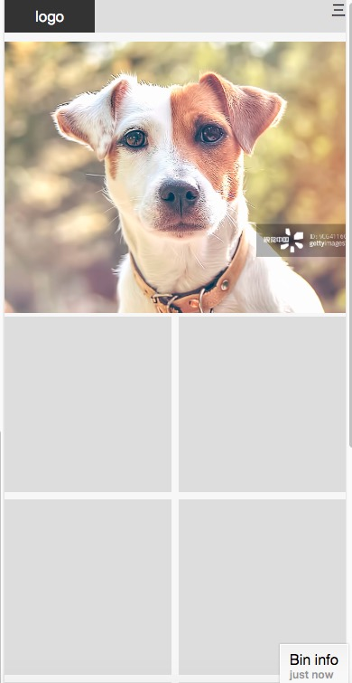

## 浮动布局-nav

[在线编辑](http://js.jirengu.com/puvey/2/edit?html,css,output)

```html
<style>
  .parent {
    border: 1px solid green;
    margin-left: auto;
    margin-right: auto;
    background: #ddd;
    min-width: 375px;
  }
  .child {
    height: 36px;
  }
  .child:nth-child(1) {
    width: 100px;
    background-color: #333;
    color: white;
    text-align: center;
    line-height: 36px;
  }
  .child:nth-child(2) {
  }
  .clearfix::after {
    content: '';
    display: block;
    clear: both;
  }
  .nav {
    line-height: 24px;
    padding: 8px 0;
  }
  .navItem {
    margin-left: 10px;
  }
</style>
<div class="parent clearfix">
  <div class="child" style="float:left;">logo</div>
  <div class="child" style="float:right;">
    <div class="nav">
      <div style="float:left;" class="navItem">导航1</div>
      <div style="float:left;" class="navItem">导航2</div>
      <div style="float:left;" class="navItem">导航3</div>
      <div style="float:left;" class="navItem">导航4</div>
      <div style="float:left;" class="navItem">导航5</div>
    </div>
  </div>
</div>
```



</img-wrapper>

浮动布局要注意清除浮动带来的副作用，推荐用伪元素来清除浮动:

```css
.clearfix::after {
  content: '';
  display: block;
  clear: both;
}
```

只要在浮动元素的父元素添加该样式即可。

## 浮动布局-平均布局

[在线编辑](http://js.jirengu.com/deqok/2/edit)

```html
<style>
  .parent {
    border: 1px solid green;
    margin-left: auto;
    margin-right: auto;
    background: #ddd;
    min-width: 375px;
  }
  .child {
    height: 36px;
  }
  .child:nth-child(1) {
    width: 100px;
    background-color: #333;
    color: white;
    text-align: center;
    line-height: 36px;
  }
  .child:nth-child(2) {
  }
  .clearfix::after {
    content: '';
    display: block;
    clear: both;
  }
  .nav {
    line-height: 24px;
    padding: 8px 0;
  }
  .navItem {
    margin-left: 10px;
  }
  .banner {
    width: 800px;
    height: 300px;
    margin-top: 10px;
    margin-right: auto;
    margin-left: auto;
    background: #888;
  }
  .pictures {
    width: 800px;
    margin: 0 auto;
    background: black;
  }
  .wrapper {
    margin-left: -4px;
    margin-right: -4px;
  }
  .picture {
    width: 194px;
    height: 194px;
    background: #ddd;
    margin: 4px;
    float: left;
  }
</style>
<div class="parent clearfix">
  <div class="child" style="float:left;">logo</div>
  <div class="child" style="float:right;">
    <div class="nav clearfix">
      <div style="float:left;" class="navItem">导航1</div>
      <div style="float:left;" class="navItem">导航2</div>
      <div style="float:left;" class="navItem">导航3</div>
      <div style="float:left;" class="navItem">导航4</div>
      <div style="float:left;" class="navItem">导航5</div>
    </div>
  </div>
</div>

<div class="banner"></div>

<div class="pictures">
  <div class="wrapper clearfix">
    <div class="picture"></div>
    <div class="picture"></div>
    <div class="picture"></div>
    <div class="picture"></div>
    <div class="picture"></div>
    <div class="picture"></div>
    <div class="picture"></div>
    <div class="picture"></div>
  </div>
</div>
```



</img-wrapper>

:::tip
这里要注意`wrapper`的作用，用负 margin 来抵消`margin:4px`，使得靠近边缘的方块能紧贴着边缘而没有空隙。
:::

## flex-平均布局

[在线编辑](http://js.jirengu.com/cidol/1/edit?html,css,output)

```html
<style>
    *{margin:0px;padding:0px;box-sizing:border-box;}
  .parent{
    border:1px solid green;
    margin-left:auto;
    margin-right:auto;
    background: #ddd;
    min-width:375px;
  }
  .child{
    height:36px;
  }
  .child:nth-child(1){
    width:100px;
    background-color:#333;
    color:white;
    text-align:center;
    line-height:36px;
  }
  .child:nth-child(2){

  }
  .clearfix::after{
    content:'';
    display:block;
    clear:both;
  }
  .nav{
    line-height:24px;
    padding:8px 0;
  }
  .navItem{
    margin-left:10px;
  }
  .banner{
    width:800px;
    height:300px;
    margin-top:10px;
    margin-right:auto;
    margin-left:auto;
    background:#888;
  }
  .pictures{
    width:800px;
    margin: 0 auto;
  }
  .wrapper{
    display:flex;
    flex-wrap:wrap;
    margin:0 -4px;
  }
  .picture{
    width:calc(25% - 8px);
    height:194px;
    background:#ddd;
    margin-top:4px;
    margin-bottom:4px;
    border:1px solid red;
    margin:4px;
  }
  .art{
    height:300px;
    background:#ddd;
    width:800px;
    margin:0 auto;
  }
  .aside{
    float:left;
    border:1px solid black;
    width:33.333333%;
    width:calc(33.33333% - 20px);
    margin-right:20px;
    height:300px;
  }
  .main{
    float:left;
    border:1px solid black;
    width:66.66666%;
    height:300px;
  }
  <div class="parent clearfix">
       <div class="child" style="float:left;">logo</div>
       <div class="child" style="float:right;">
         <div class="nav clearfix">
           <div style="float:left;" class="navItem">导航1</div>
           <div style="float:left;" class="navItem">导航2</div>
           <div style="float:left;" class="navItem">导航3</div>
           <div style="float:left;" class="navItem">导航4</div>
           <div style="float:left;" class="navItem">导航5</div>
         </div>
       </div>
    </div>

    <div class="banner"></div>

    <div class="pictures">
      <div class="wrapper">
        <div class="picture"></div>
        <div class="picture"></div>
        <div class="picture"></div>
        <div class="picture"></div>
        <div class="picture"></div>
        <div class="picture"></div>
        <div class="picture"></div>
      </div>
    </div>

    <div class="art clearfix">
      <div class="aside">广告一</div>
      <div class="main">广告二</div>
    </div>
</style>
```



</img-wrapper>

:::tip
该方式布局，即使`picture`元素的个数不是 4 的倍数，也能按原先的方式排列下去
:::

## 手机端布局

加入了媒体查询，同时宽度用`%`作为单位：[在线编辑](http://js.jirengu.com/cubak/2/edit)

```html
<style>
    *{box-sizing: border-box;}
  *{margin: 0;padding:0;}
  .parent{

    margin-left: auto;
    margin-right: auto;
    background: #ddd;
  }
  .child{


  }
  .child:nth-child(1){
    width: 100px;
    background-color: #333;
    color: white;
    text-align: center;
    height: 36px;
    line-height: 36px;
    float:left;
  }
  .child:nth-child(2){
    float:right;
  }
  .parent .nav2{
    display: none;
  }
  @media (max-width: 420px){
    .parent .nav2{
      display: block;
    }
    .parent .nav{
      display: none;
    }
  }
  .clearfix::after{
    content: '';
    display: block;
    clear: both;
  }
  .clearfix{
    zoom: 1;
  } /*IE 6*/

  .content{
    border: 1px solid black;
    margin-right: 10px;
  }

  .nav{
    line-height: 24px;
    padding: 6px 0;
  }
  .navItem{
    margin-left: 20px;
    float:left;
  }

  .banner{
    width: 800px;
    height: 300px;
    background: #888;
    margin-left: auto;
    margin-right: auto;
    margin-top: 10px;
    background: transparent url(https://goss1.vcg.com/creative/vcg/800/version23/VCG41160250211.jpg) no-repeat center;
    background-size: cover;
  }
  @media (max-width: 420px){
    .banner{width: auto;}
  }
  .pictures{
    width: 800px;
    margin: 0 auto; /*1*/
    overflow: hidden;
  }
  @media (max-width: 420px){
    .pictures{width: auto;}
  }
  .pictures > .xxx{
    display: flex;
    flex-wrap: wrap;
    margin: 0 -4px;
  }
  .picture{
    width: calc(25% - 8px);
    height: 194px;
    background: #ddd;
    margin: 4px;
  }
  @media (max-width: 420px){
    .picture{
      width: calc(50% - 8px);
    }
  }

  .art{
    background: #ddd;
    width: 800px;
    margin: 0 auto;
    display: flex;
    justify-content: space-between;
  }
  @media (max-width: 420px){
    .art{
      width: auto;
      flex-direction: column;
    }
  }
  .art>.sider{
    border: 1px solid black;
    width: calc(33.333333% - 20px);
    height: 300px;
  }
  @media (max-width: 420px){
    .art>.sider{
      width: auto;
      height: auto;
    }
  }

  .art>.main{
    border: 1px solid black;
    width: 66.6666666%;
    height: 300px;
  }
  @media (max-width: 420px){
  .art>.main{
    width: auto;
    height: auto;
  }
  }
  <div class="parent clearfix">
      <div class="child">logo</div>
      <div class="child">
        <div class="nav clearfix">
          <div class="navItem">导航1</div>
          <div class="navItem">导航2</div>
          <div class="navItem">导航3</div>
          <div class="navItem">导航4</div>
          <div class="navItem">导航5</div>
        </div>
        <div class="nav2">三</div>
      </div>
    </div>

    <div class="banner"></div>

    <div class="pictures">
      <div class="xxx">
        <div class="picture"></div>
        <div class="picture"></div>
        <div class="picture"></div>
        <div class="picture"></div>
        <div class="picture"></div>
        <div class="picture"></div>
        <div class="picture"></div>
      </div>
    </div>

    <div class="art">
      <div class="sider">
        广告1
      </div>
      <div class="main">
        广告2
      </div>
    </div>
</style>
```



</img-wrapper>

:::tip
为了防止图片在页面放大的时候变形，把图片作为背景来呈现，而不是用 img 标签
:::
