# js-cli
一个基于 `rush`、`pnpm`、`node` 、`typescript` 开发的高性能、易扩展脚手架。

## 安装

```shell
npm install @js-cli/core -g or yarn add @js-cli/core -g
```

## 命令
目前已开发完的命令有:
- `js-cli init`: 根据模板始化项目
- `js-cli add`: 在项目中添加页面
- `js-cli publish`: 发布项目

### init
可供初始化的模板分为`项目`、`组件` 两大类，以初始化一个项目为例, 运行`js-cli init`后选择 `项目`:

   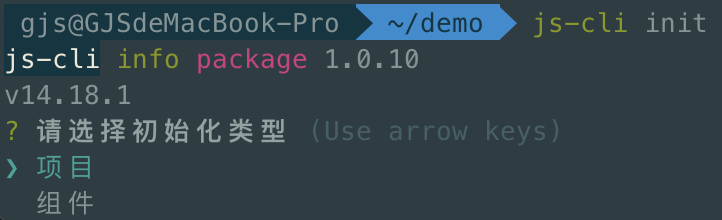
</img-wrapper>
填写项目名、版本内容后开始自动下载模板、安装依赖、启动项目:

   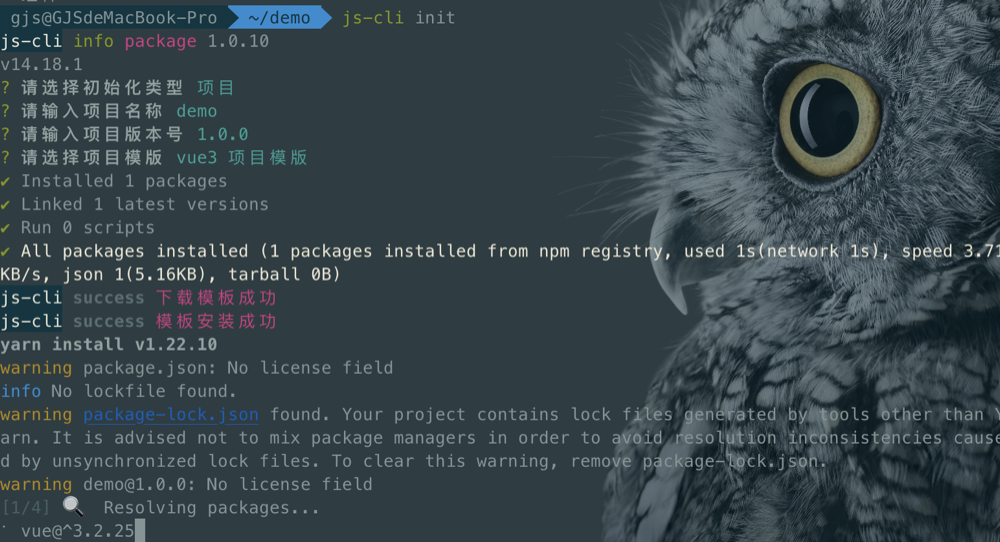
</img-wrapper>
> 模板下载成功后，会在用户根目录 `.js-cli` 文件夹内进行缓存，后续在安装相同模板时，缓存好的模板会同线上版本进行比较，若缓存的版本为最新，则直接从缓存拷贝模板不再下载；若缓存的版本落后于线上，则从线上下载并更新缓存。
### add

日常开发中，在项目中引入新的组件是很常见的操作，但是对于更复杂的应用场景，可能是由多个组件组合而成的一个页面，`js-cli add` 可在项目中直接引入一个新的页面，页面相关的文件都会被一起拷贝进项目里，新页面的依赖会和项目的依赖进行合并:

   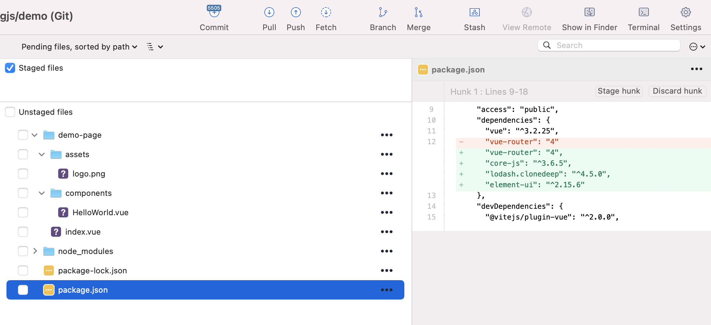
</img-wrapper>
在合并依赖的过程中，若项目依赖和页面依赖发生冲突，需要开发者手动解决。

   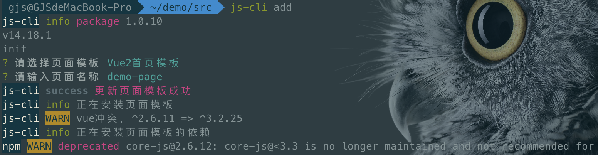
</img-wrapper>
> 新页面会拷贝到执行 `js-cli` 命令的目录下。

### publish
发布命令实现的功能有:
- Git
    - Git 远程仓库初始化（利用 Github & Gitee OpenAPI）
    - 本地 Git 初始化
    - GitFlow 流程实现（自动提交代码、合并、推送分支、删除分支）
- 云发布模块
    - 源码下载、依赖安装、打包构建
    - 基于 websocket 的前后端通信
    - 基于 redis 的任务系统
    - oss 文件上传
    - 支持 hash 和 history 两种模式发布

在第一次执行`js-cli`时，需要选择代码托管平台、仓库类型(个人/组织)以及对应平台的授权`token`:

   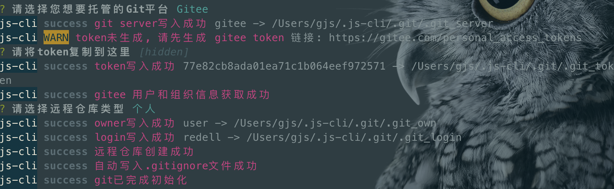
</img-wrapper>

若检测到有代码未提交，脚手架会自动 `commit` 并提示用户输入 `commit` 信息:

   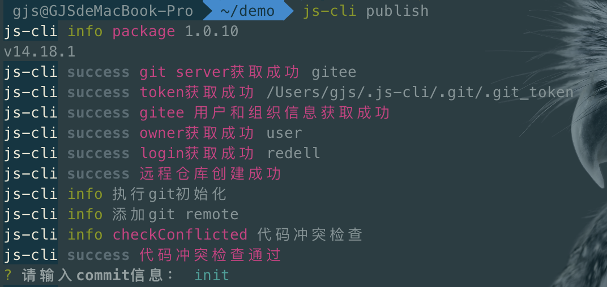
</img-wrapper>

第一次发布还需要选择上传打包后代码的平台，目前仅支持 `oss`:

   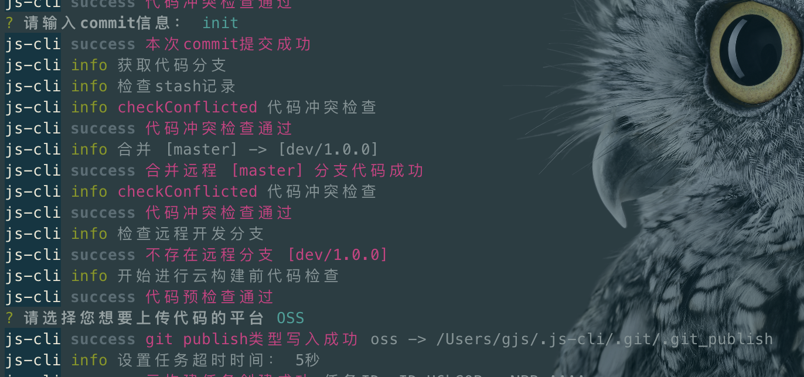
</img-wrapper>

开始进行云构建:

   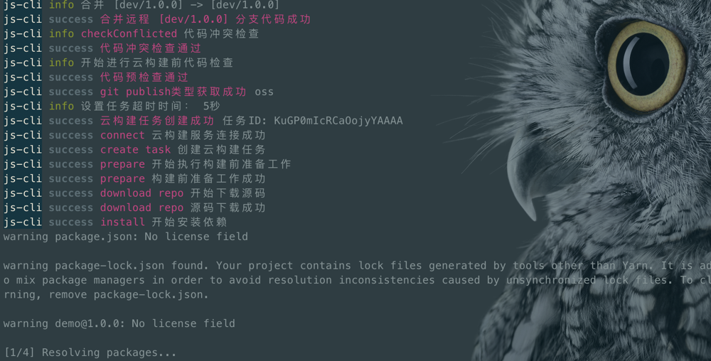
</img-wrapper>

发布构建产物:

   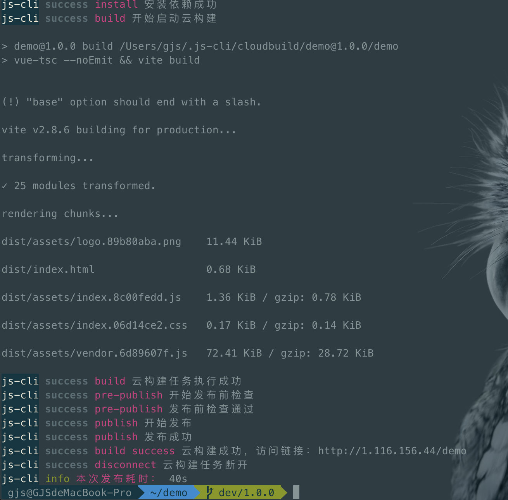
</img-wrapper>

这样就把 `dev/1.0.0`的代码发布到了线上，若测试通过，这需要把 `dev/1.0.0`分支的代码合并到 `master` 重新再发一遍，这时候需要加个参数，运行 `js-cli publish --prod`:

   
</img-wrapper>

发布完成后会删掉本地和远程的开发分支，并根据版本号打 `tag`

   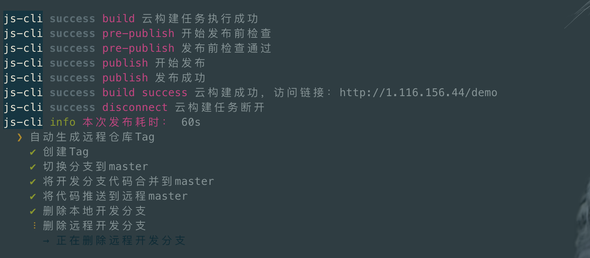
</img-wrapper>

后续迭代新功能时，根据提示信息选择升级对应的版本:

   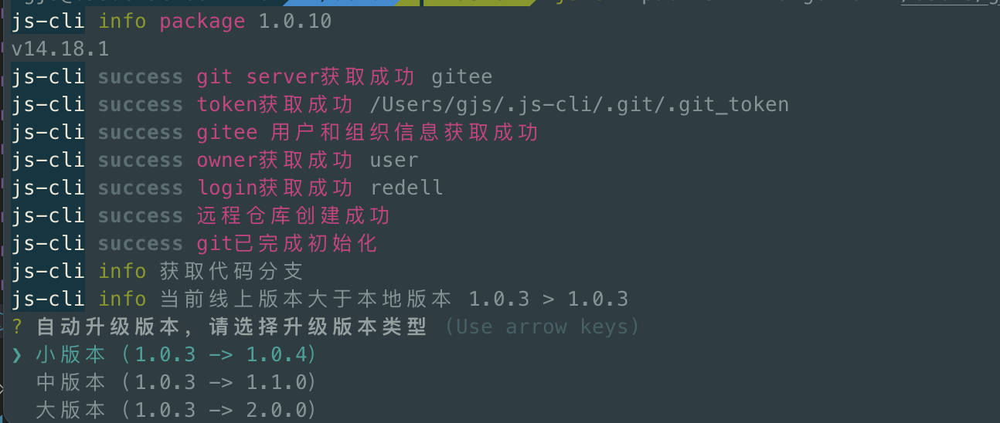
</img-wrapper>

除了 `--prod` 参数外，`js-cli publish` 还支持下列参数传递:
`--refreshServer`: 强制更新远程Git仓库
`--refreshToken`: 强制更新远程仓库token
`--refreshOwner`: 强制更新远程仓库类型
`--buildCmd`: 自定义构建命令,默认命令 `npm run build`
`--prod`: 是否正式发布
`--sshUser`: 目标服务器用户名
`--sshIp`: 目标服务器IP或域名
`--sshPath`: 目标服务器存储构建产物的路径


