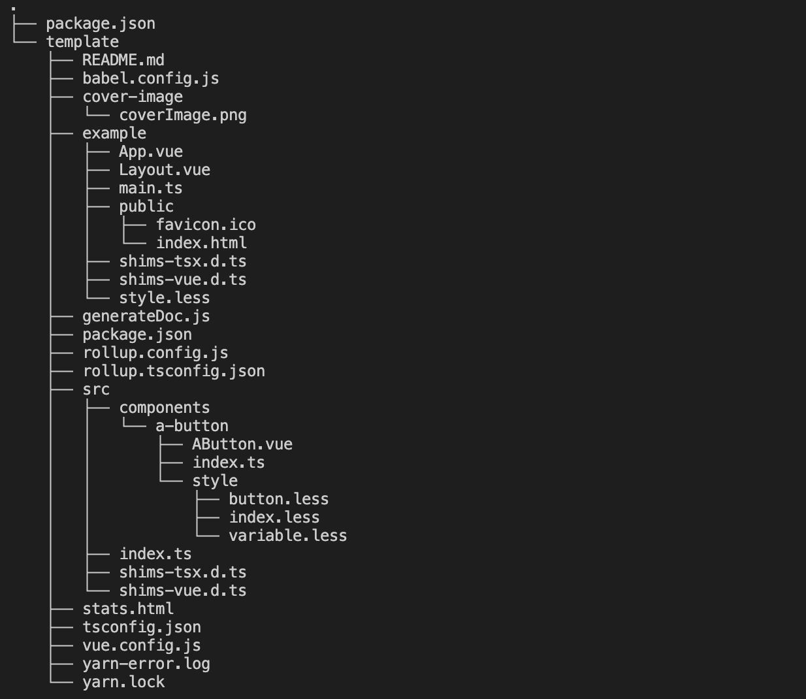
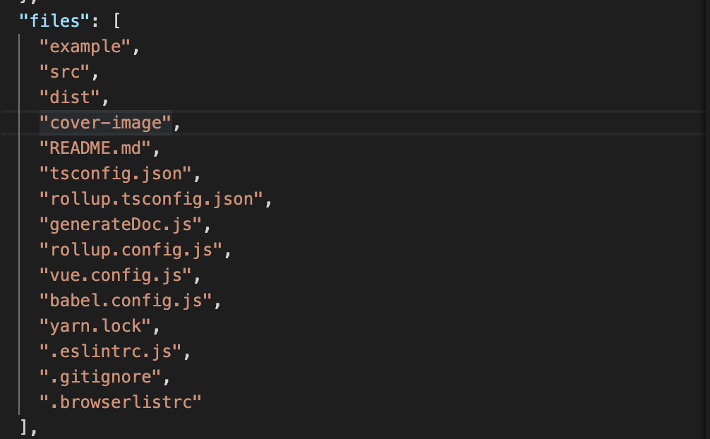

# 模板
`js-cli` 脚手架所使用的模板，都是以 `npm` 发包的形式把源码存储在`npm.js`官网上，同时在本地数据库记录模板的包名称、版本号,再通过`npm`官方提供的请求库`npminstall`可以很方便的把源码下载下来，本地数据库除了存储这些信息，还可以存储每个模板对应的安装依赖、打包项目等配置。这样把源码和使用源码的配置信息进行了分离，后期可以根据实际的需要，很方便的去扩展模板更多的配置信息。

## 新增模板
新建一个`new-template`文件，进入文件夹并通过`npm init -y`完成初始化，在文件夹内再新建一个`template`文件夹，这个文件夹就是用来存放模板的源码，当把模板源码拷贝到`template`目录后，整个文件夹的目录如下所示：

   
</img-wrapper>

把`./template/paclage.json`文件中的 `name`、 `version` 换成 cjs 语法 `<%= className %>` 、 `<%= version %>`, 这两个字段的值会在用户执行模板初始化的时候被替换成用户输入的内容;
在根目录下的`./package.json`文件里新增:
```json
"publishConfig": {
    "access": "public"
  },
```
`name`和`version`两个字端根据自己的实际需求进行更改，这两个字段最终要落到数据库里，最终`js-cli`将通过这两个字段去下载对应的源码。

改完之后，便可以在根目录下执行`npm publish`把包含`template`在内的所有文件都发布到`npm`上，发布成功后，再通过接口去更新模板信息。

如果发布成功，但是发现下载下来的源码内容不全，可以通过修改`template/package.json`文件的`file`字段，把需要上传的文件都添加进去:

   
</img-wrapper>

最后，通过[新增模板接口](https://www.apifox.cn/apidoc/project-690216/api-13739006),把模板的相关信息保存到数据库里