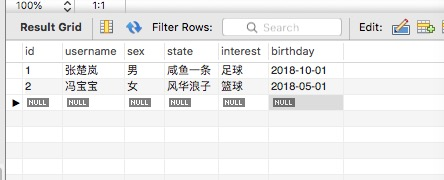
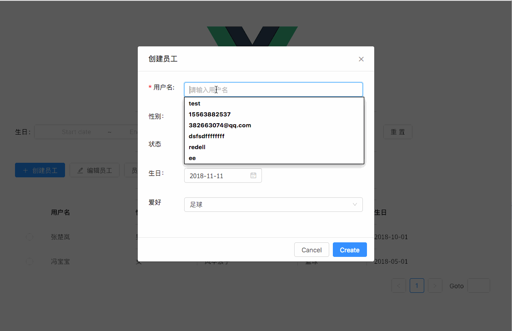

这部分就是后台系统很常见的功能、也是主要的功能了,把这部分内容都完成了，一个后台的管理系统也基本完成的七七八八了。

## 发送 Token

前面在用户登录成功后，服务器会给客户端返回一个 token，那么以后客户端每次发送请求都要带上 token，服务器验证通过了才会返回数据。
因为我们用了`koa-jwt`，所以只需要在每条请求头上加上`Authorization`属性，值是`Bearer {token值}`，然后让 Koa 在接收请求之前验证一下 token 即可，我们把`token`绑定到`axios`的`header`里，这样每次发送请求默认都会带上`token`了。

打开`src/main.js`，在路由跳转的钩子里加上这句：

```js
//main.js

...
router.beforeEach((to, from, next) => {
  const token = sessionStorage.getItem('demo-token')
  if (to.meta.requiresAuth) {
    if (token !== 'null' && token != null) {
      // 全局设定header的token验证,注意Bearer后有个空格
      Vue.prototype.$http.defaults.headers.common['Authorization'] = 'Bearer ' + token
      next()
    } else {
      message.warning('请先登录')
      next('/login')
    }
  } else {
    next()
  }
})
```

## 获取数据

我们先在数据库里手动添加一条数据，然后再写一个获取数据库里数据的方法。

<div style="text-align: center"></div>

打开`server/models/management.js`，新增一个`getOperator`方法：

```js
//models/management.js

import db from '../config/db.js' // 引入user的表结构
const managementModel = '../schema/management.js'
const DemoDb = db.Demo // 引入数据
const Management = DemoDb.import(managementModel) // 用sequelize的import方法引入表结构
const getOperator = async function(params) {
  const result = await personnelTable.findAndCountAll({
    offset: (params.page - 1) * params.pageSize,
    limit: params.pageSize
  })
  return result // 返回数据
}
export default {
  getOperator
}
```

通常数据库里的数据都是成千上万条的，如果一次性获取全部数据，一来是数据库读取速度慢，二来前端页面一下子渲染这么多数据也会需要较长时间，所以我们一般采用分页这种友好的方式去获取数据，这里选用里`findAndCountAll`这个方法，`offset`表示页码，`limit`表示每页的数据条数；如果要一次性获取全部的数据，可以用`findAll`这个方法。

同样需要修改`controller/management.js`:

```js
//controllers/management.js

import management from '../models/management.js'
import moment from 'moment'
import 'moment/locale/zh-cn'
moment.locale('zh-cn')

const getOperator = async function(ctx, next) {
  const data = ctx.request.body
  const result = await management.getOperator(data)
  if (result !== null) {
    ctx.response.body = {
      success: true,
      result: result
    }
  } else {
    ctx.response.body = {
      success: false,
      data: '获取数据出错'
    }
  }
}

export default {
  getOperator
}
```

更新路由`routes/router.js`:

```js
//routes/router.js
import ManagementController from './../controllers/management.js'
import jwt from 'koa-jwt'
...

export default function (app) {
  router.post('/user/:id', UserController.getUserInfo)
  router.post('/api/user', UserController.getUserAuth)
  router.post('/api/getOperator', jwt({secret: 'vue-koa-demo'}), ManagementController.getOperator)
```

这里的`jwt({secret: 'vue-koa-demo'})`就是要求前端如果想获取`/api/getOperator`这个 API 的数据，就必须带上`token`，也就是之前用户登录成功后服务器返回给用户的`token`，我们在上文已经把这个`token`绑定到`axios`的请求头上了。

修改`app.js`,捕捉`jwt`验证失败的错误信息：

```js
//app.js
...
app.use(async function (ctx, next) {  //  如果JWT验证失败，返回验证失败信息
  try {
    await next()
  } catch (err) {
    if (err.status === 401) {
      ctx.status = 401
      ctx.body = {
        success: false,
        token: null,
        info: '没有权限'
      }
    } else {
      throw err
    }
  }
})

app.on('error', function (err, ctx) {
  console.log('server error', err)
})
...
```

接着我们需要在前端发起数据的请求了，这个请求应该在我们页面刚加载的时候就去服务器里请求数据，所以我们在`mounted()`方法里面调用获取数据的方法，修改`src/components/userTable.vue`:

```js
//userTable.vue
...

 // 动态获取数据
     async request () {
      let _this = this
      let url = '/api/getOperator'
      let params = this.params
      this.$http.post(url,params)
        .then(res => {
          res.data.result.rows.map((item, index) => {
            item.key = index
          })    //给每条数据添加唯一的key值
          _this.total = res.data.result.count
          _this.dataSource = res.data.result.rows
        })
    },

 mounted () {
    this.request()
  }
...
```

然后我们刷新一下页面，会发现我们已经拿到刚才添加到数据库里面的两条数据了：


</img-wrapper>

## 添加数据、更新数据、删除数据

上图中的四个按键功能`创建员工` `编辑员工` `员工详情` `删除员工`在前端页面里都共用了一个 model，所以打算把四个按键功能的方法也通过封装的方式写在一起。

修改`server/models/management.js`:

```js
//models/management.js
...

// 新增数据
const createOperator = async function (data){
  const userInfo = await Management.create({ // 用await控制异步操作，将返回的Promise对象里的数据返回出来。也就实现了“同步”的写法获取异步IO操作的数据
      username: data.username,
      sex: data.sex,
      state: data.state,
      interest: data.interest,
      birthday: data.birthday
  });
  return userInfo // 返回数据
}

// 更新数据
const updateOperator = async function (data) {
  const result = await Management.update(
    {
      username: data.username,
      sex: data.sex,
      state: data.state,
      interest: data.interest,
      birthday: data.birthday
    },
    {
      where: {
        id: data.id
      }
    }
  )
  return result // 返回数据
}

//删除数据
const deleteOperator = async function (params) {
  const result = await Management.destroy({
    where: {
      id: params.id
    }
  })
  return result // 返回数据
}

export default {
  createOperator, // 导出createOperator的方法，将会在controller里调用
  getOperator,
  deleteOperator,
  updateOperator
}
...
```

同样需要修改`controller/management.js`:

```js
//controller/management.js
...

//更新数据
const updateOperator = async function (ctx, next) {
  const data = ctx.request.body
  data.birthday = moment(data.birthday).format('YYYY-MM-DD')
  const result = await management.updateOperator(data)
  if (result !== null) {
    ctx.response.body = {
      success: true,
      result: result
    }
  } else {
    ctx.response.body = {
      success: false,
      result: '更新失败'
    }
  }
}

//删除数据
const deleteOperator = async function (ctx, next) {
  const data = ctx.request.body
  const result = await management.deleteOperator(data)
  if (result > 0) {
    ctx.response.body = {
      success: true,
      result: '删除成功'
    }
  } else {
    ctx.response.body = {
      success: false,
      data: '删除失败'
    }
  }
}

export default {
  createOperator, // 导出createOperator的方法，将会在router.js里调用
  getOperator,
  deleteOperator,
  updateOperator
}
```

更新路由`routes/router.js`:

```
`routes/router.js`
...

router.post('/api/createOperator', jwt({secret: 'vue-koa-demo'}), ManagementController.createOperator)
  router.post('/api/deleteOperator', jwt({secret: 'vue-koa-demo'}), ManagementController.deleteOperator)
  router.post('/api/updateOperator', jwt({secret: 'vue-koa-demo'}), ManagementController.updateOperator)

  ...
```

修改`userForm.vue`里面的`handleCreate`方法：

```js
//userForm.vue
import { Form, Select, Radio, message } from 'ant-design-vue'
import moment from 'moment'
const FormItem = Form.Item
const Option = Select.Option
const RadioGroup = Radio.Group
...

async handleCreate  () {
      const form = this.formRef.form
      let _this = this
      form.validateFields(async (err, values) => {
        if (err) {
          return
        }
        let params = {
          username: values.username,
          sex: values.sex,
          state: values.state,
          birthday: values.birthday,
          interest: values.interest,
          id: _this.title === '创建员工' ? null : _this.userInfo.id
        }
        let url= _this.title === '创建员工' ? '/api/createOperator' : '/api/updateOperator'
        this.$http.post(url,params)
          .then((res) => {
            if (res.data.id ) {
              message.success('创建成功')
              form.resetFields()
              _this.$emit('hideForm', 'update')
            }
            if (res.data.result.length) {
              message.success('更新成功')
              _this.$emit('hideForm', 'update', params)
            }
          })
      })
    },
```

最后修改`Helloword.vue`里面的`handleOperator`:

```js
//Helloword.vue
import { Modal, message } from 'ant-design-vue'
import UserTable from './UserTable'
import UserForm from './UserForm'
import SearchForm from './SearchForm'
...
//操作员工
    // 操作员工
    handleOperator (type) {
      let _this = this
      let deleteId
      if (type === 'create') {
        this.title = '创建员工'
        this.visible = true
        // 因为共用一个Form表单，当用户新建员工时，即使选中了table里面的某一行数据，打开的From表单应该只有默认值，所以这里要清空userInfo；通过selectItem来判断用户有没有选中table的数据
        this.userInfo = null
      } else if (type === 'edit' || type === 'detail') {
        if (this.selectItem.id == undefined) {
          Modal.info({
            title: '信息',
            content: '请选择一个用户'
          })
          return
        }
        this.title = (type === 'edit' ? '编辑用户' : '用户详情')
        this.visible = true
        this.userInfo = this.selectItem
      } else if (type === 'delete') {
        deleteId = this.selectItem.id
        if (this.selectItem.id  == undefined) {
          Modal.info({
            title: '信息',
            content: '请选择一个用户'
          })
          return
        }
        Modal.confirm({
          content: '确定要删除此用户吗？',
          onOk: async () => {
            let url = '/api/deleteOperator'
            let params = {
              id: deleteId
            }
            _this.$http.post(url,params)
               .then((res) => {
                  if (res.data.result === '删除成功') {
                    message.success('删除成功')
                     this.requestList= !_this.requestList
                     this.selectItem.id = undefined
                     this.hackReset = false
                     this.$nextTick(() => {
                     this.hackReset = true
                     })
                  }
               })
           }
        })
      }
    },
```

好了，下面让我们来看下效果：



</img-wrapper>

OK！没问题。

如果看了代码，会发现其实操作数据库没有那么难(感谢大神们 🙏)，增、删、改、查分别都有对应的方法可以调用

## 数据查找

最后，我们做一下按条件查找的功能，这个教程就接近尾声了。其实做到这里，整个前后端交互逻辑，大家应该都已经比较清楚了。`router`作为前端的访问路径，`controllers`是前后端数据交互的缓冲层，`model`是后端访问数据库的方法。

修改`server/models/management.js`,新增`searchOperator`方法：

```js
//models/management.js`
...
// 按设置条件进行查找
const searchOperator = async function (params) {
  params.state === '全部' ? params.state = ['咸鱼一条', '风华浪子', '北大才子一枚', '百度FE', '创业者'] : params.state = [params.state]
  params.sex === '全部' ? params.sex = ['男', '女'] : params.sex = [params.sex]
  const result = await Management.findAll({
    where: {
      state: {
        $in: params.state
      },
      sex: {
        $in: params.sex
      },
      birthday: {
        $between: [params.birthday[0], params.birthday[1]]
      }
    }
  })
  return result // 返回数据
}
...
```

修改`server/controllers/management.js`,新增`searchOperator`方法：

```js
controllers/management.js
...
const searchOperator = async function (ctx, next) {
  const data = ctx.request.body
  console.log(data)
  data.birthday[0] = moment(data.birthday[0]).format('YYYY-MM-DD')
  data.birthday[1] = moment(data.birthday[1]).format('YYYY-MM-DD')
  const result = await management.searchOperator(data)
  if (result !== null) {
    ctx.response.body = {
      success: true,
      result: result
    }
  } else {
    ctx.response.body = {
      success: false,
      data: '获取数据出错'
    }
  }
}
...
```

更新`routes/router.js`:

```js
// router.js`
...
router.post('/api/searchOperator', jwt({secret: 'vue-koa-demo'}), ManagementController.searchOperator)
...
```

更改前端页面`SearchFrom.vue`里面的`handleSubmit`方法：

```js
handleSubmit (e) {
      e.preventDefault()
      this.form.validateFields((err, values) => {
        if (!err) {
          // 如果用户没有选择时间段，就给一个大范围的时间段搜索范围
          if (!values.birthday) {
            values.birthday = []
            values.birthday[0] = moment(new Date(1900, 0, 1)).format('YYYY-MM-DD')
            values.birthday[1] = moment(new Date(2100, 0, 1,)).format('YYYY-MM-DD')
          }
          this.$emit('searchOperator', values)
        }
      })
    },
```

我们来看下最终的效果：


  
</img-wrapper>

大功告成。
