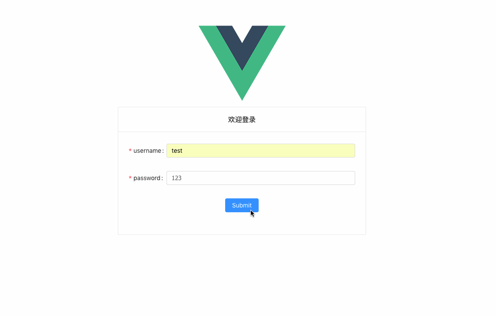
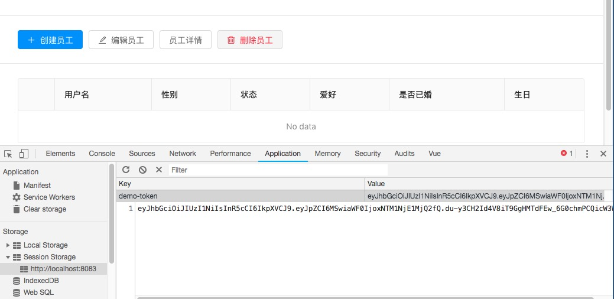
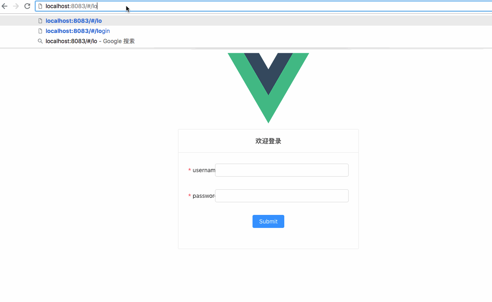
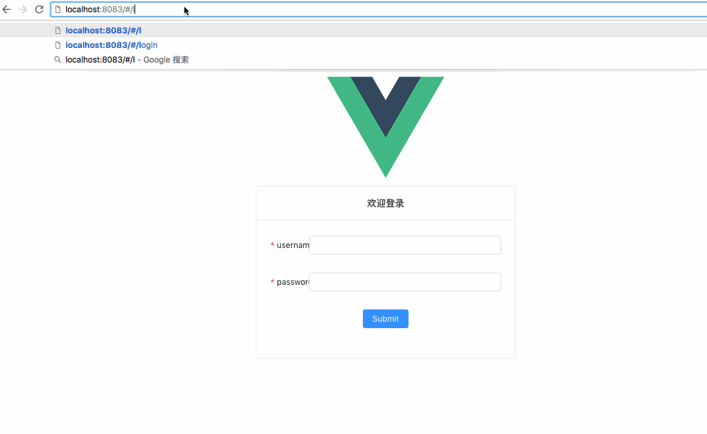

## JSON-WEB-TOKEN

用户的登录验证我们采用目前比较火的`JSON-WEB-TOKEN`验证方式，相比于基于 cookie 或者 session 的登录验证 jwt 是真正的无状态请求，不占用服务器的资源，不存在跨域的问题，简单说说
jwt 的原理:

- 用户输入账号密码登录，会把账户密码（密码用 md5 加密）发送给后端
- 后端验证用户的账号和密码信息，如果匹配，就返回一个 TOKEN 给客户端；如果验证失败，就返回验证错误信息
- 登录成功成功后，客户端会将服务器返回的 TOKE 保存下来（SessionStorage、LocalStorage）,之后要请求其他资源的时候，在请求头（Header）里带上这个 TOKEN 进行请求
- 后面服务器在收到客户端的请求时，会先验证一下 TOKEN 是否有效，有效则返回请求的资源，无效则返回验证错误
  更详细的关于`JSON-WEB-TOKEN`的介绍，可参考[阮一峰的博客](http://www.ruanyifeng.com/blog/2018/07/json_web_token-tutorial.html)
  通过这个 TOKEN 的方式，客户端和服务端之间的访问，是无状态的：也就是服务端不知道你这个用户到底还在不在线，只要你发送的请求头里的 TOKEN 是正确的我就给你返回你想要的资源。这样能够不占用服务端宝贵的空间资源，而且如果涉及到服务器集群，如果服务器进行维护或者迁移或者需要 CDN 节点的分配的话，无状态的设计显然维护成本更低。
  安装`jwt`:

```
yarn add koa-jwt
```

在`models`里的`user.js`新加一个通过用户名查找用户的方法：

```js
// models/user.js
// ......
// 前面的省略了

// 新增一个方法，通过用户名查找
const getUserByName = async function(name) {
  const userInfo = await User.findOne({
    where: {
      username: name
    }
  })

  return userInfo
}

export default {
  getUserById, // 导出getUserById的方法，将会在controller里调用
  getUserByName
}
```

接着修改`controllers`里的`user.js`：

```js
// controllers/user.js
// ......
// 前面的省略了

// 新增一个方法，通过用户名查找
const getUserAuth = async function(ctx, next) {
  const data = ctx.request.body // post过来的数据存在request.body里
  const userInfo = await user.getUserByName(data.name)

  if (userInfo != null) {
    // 如果查无此用户会返回null
    if (userInfo.password != data.password) {
      ctx.response.body = {
        success: false, // success标志位是方便前端判断返回是正确与否
        info: '密码错误！'
      }
    } else {
      // 如果密码正确
      const userToken = {
        name: userInfo.username,
        id: userInfo.id
      }
      const secret = 'vue-koa-demo' // 指定密钥，这是之后用来判断token合法性的标志
      const token = jwt.sign(userToken, secret) // 签发token
      ctx.response.body = {
        success: true,
        token: token // 返回token
      }
    }
  } else {
    ctx.response.body = {
      success: false,
      info: '用户不存在！' // 如果用户不存在返回用户不存在
    }
  }
}
```

::: tip 提示
`userToken`里面的内容是可以自定义的，加密后存储在 token 里返回给前端，前端如果想拿到 token 里面的内容，需要解码，安装`koa-jwt`，从`koa-jwt`导入`jwt`，然后调用`jwt.decode(token)`拿到`userToken`里面的内容。
:::
更新一下`router.js`规则：

```js
//router.js

import KoaRouter from 'koa-router'
import UserController from './../controllers/user.js'
const router = KoaRouter()
export default function(app) {
  router.post('/user/:id', UserController.getUserInfo)
  router.post('/api/user', UserController.getUserAuth)
  app.use(router.routes()).use(router.allowedMethods())
}
```

后端 API 写完了，我们开始写前端请求

## Axios

[axios](https://github.com/axios/axios)是一个基于 Promise 用于浏览器和 nodejs 的 HTTP 客户端,非常火，在 github 上已经有了将近 50000 个 star 了，具体的使用方法大家可以参考官网，文档写的非常详细。先安装一下`axios`:

```
yarn add axios
```

在`src\main.js`里引入 axios，

```js
// scr/main.js

// ...

import Axios from 'axios'

Vue.prototype.$http = Axios // 绑定到Vue的$http实例上

// ...
```

修改`Login.vue`,编写登录方法`handleSubmit`：

```js
// Login.vue
// 省略前面的部分

  methods: {
    handleSubmit (e) {
      e.preventDefault()
      this.form.validateFields((err, values) => {
        if (!err) {
          let obj = {
            name: values.username,
            password: values.password
          }
          this.$http.post('/api/user', obj) // 将信息发送给后端
            .then((res) => { // axios返回的数据都在res.data里
              if(res.data.success){ // 如果成功
                sessionStorage.setItem('demo-token',res.data.token) // 用sessionStorage把token存下来
                message.success('登录成功')
                this.$router.push('/') // 进入后台管理页面，登录成功
              } else {
                 this.$message.error(res.data.info) // 登录失败，显示提示语
                 sessionStorage.setItem('demo-token',null) // 将token清空
                }
              }, (err) => {
              message.error('请求错误！')
              sessionStorage.setItem('demo-token',null)// 将token清空
            })
        }
      })
    }
  }
}
</script>
```

登录框里的`username`和`password`的值，`antd`这个框架都帮我们封装在了`this.form.validateFields((err, values)`里的`values`这个参数里面了。

## bcryptjs-密码加密

以前，我们习惯前端用 md5 给信息加密再提交给后端，但是后来发现这种方式并不安全，因为 html 是明文传输，即使是加密后的数据也能被第三方截取，他们可以直接拿着加密后的信息去后端请求数据；所以前端加密并不太靠谱，最安全的方式是采用`https传输协议`，加密的步骤放在后端。为什么需要后端加密呢？假如你登录过的某个网站数据库被攻击导致数据泄露，而你的密码是以明文保存在数据库的，那么黑客就可以拿你的密码去撞库，因为我们经常好几个网站的密码都是相同的，那意味着一个网站被攻击，你其他的网站的数据也不安全了。
安装 bcryptjs：

```
yarn add bcryptjs
```

在`controllers/user.js`引入`bcryptjs`

```js
//controllers/user.js
import bcrypt from 'bcryptjs'
// 省略前面的部分

 if (userInfo != null) { // 如果查无此用户会返回null
    if (!bcrypt.compareSync(data.password, userInfo.dataValues.password)) { // 验证密码是否正确
      ctx.response.body = {
        success: false, // success标志位是方便前端判断返回是正确与否
        info: '密码错误！'
      }
    } else { // 如果密码正确
// 省略后面的部分
```

然后我们需要把我们数据库里`123`这个明文密码 bcrypt 化，加密后变为：`$2a$10$x3f0Y2SNAmyAfqhKVAV.7uE7RHs3FDGuSYw.LlZhOFoyK7cjfZ.Q6`，替换数据库里的`123`.
::: tip 提示
如果我们做注册功能，用户注册成功后提交到后端的密码，需要我们用 bcrypt 加密后再存到数据库里,不要把密码等敏感信息用明文的方式存到数据库里
:::

## 跨域

在进行前后端联调的时候，我们还得解决跨域的问题。像现在，我们的 koa 服务器跑在`3000`端口，而前端是跑在`webpack`为我们提供的`8080`端口，端口不一样，存在跨域的情况，没法直接传输数据。解决跨域通信的方法常用的两种方法：

1. 服务端在请求头上加上`CORS`允许跨域，客户端即可用类似`axios`这样的工具跨域发送请求
2. 变成同域
   如果使用第一种方法的话，可以借助[koajs](https://github.com//cors)这个中间件
   如果前端人员也能自己解决跨域的问题，那我们就没必要麻烦后端了，这里我们选用第二种办法。
   打开根目录下`config/index.js`文件，找到`dev`下的`proxyTable`，利用这个`proxyTable`这个代理工具，把外部的请求通过 webpack 转发给本地，也就把跨域请求变成同域请求了：

```js
//config/index.js

前面省略
module.exports = {
  dev: {
    // Paths
    assetsSubDirectory: 'static',
    assetsPublicPath: '/',
    proxyTable: {
        '/api': {
          target: 'http://localhost:3000',
          changeOrigin: true
        }
    },
    省略...
```

`proxyTable`的作用是：当我们在组件里发出的请求地址是/api/xxxx 的时候，实际上请求的是http://localhost:3000/api/xxxx，由于webpack帮我们代理了localhost的3000端口的服务，所以我们可以把实际是跨域的请求当做是同域下的接口来调用。

然后重新启动一下前端`webpack`服务，先`ctrl+c`退出当前进程，然后`yarn dev`或者`npm run dev`,输入网址`http://localhost:8080/#/login`,输入账号`test`,密码`123`,然后登录：


  
</img-wrapper>

登录成功，我们打开浏览器的后台查看`Session Storage`:


  
</img-wrapper>

后端返回给我们的`token`也已经被保存下来了。

## 路由拦截

在前端服务刚启动的时候或者手动修改地址栏的地址改成`http://localhost:8080/`也会跳转到管理页面，这与我们的需求违背，我们需要用户登录成功后才能跳转到管理后台:


  
</img-wrapper>

这里就要用到后端给我们传回来的`token`,有 token 就说明我们的身份是经过验证的，可以跳转到后台管理页面，否则就是非法的。我们用`vue-router`做一下前端的全局拦截，打开`src/main.js`，加入以下内容：

```js
//src/main.js
前面省略
Vue.config.productionTip = false
router.beforeEach((to, from, next) => {
  const token = sessionStorage.getItem('demo-token')
  if (to.meta.requiresAuth) {
    if (token !== 'null' && token != null) {
      //判断是否存在 token
      next()
    } else {
      message.warning('请先登录')
      next('/login')
    }
  } else {
    next()
  }
})
```

打开`src/router/index.js`,改成如下内容：

```js

//src/router/index.js
前面省略
routes: [
    {
      path: '/',
      name: 'HelloWorld',
      component: HelloWorld,
      meta: {requiresAuth: true}   //表示进入HelloWorld页面是需要验证的
    },
    {
      path: '/login',
      name: 'Login',
      component: Login
    }
```

重启服务器`npm run dev`,或者直接清除浏览器缓存刷新网页，保证`token`被清除掉就行，会发现在未登录的情况下，无法跳转到后台管理页面，说明拦截功能生效了。


  
</img-wrapper>
