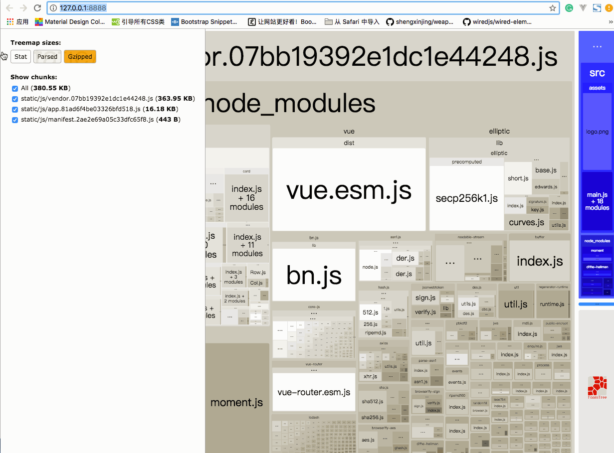

走到这里，说明我们的项目在开发环境跑起来是没问题了，但是如果我们想让别人也能访问咱们的网站，就需要部署到服务器上，也就是所谓的生产环境。

我们要做的就是把`Vue`和`Koa`结合起来变成一个完整的项目,将 Vue 的静态文件交给 Koa“托管”，所有访问前端的请求全部走 Koa 端，包括静态文件资源的请求，也走 Koa 端，把 Koa 作为一个 Vue 项目的静态资源服务器，这样的话也就不存在跨域的问题了（相当于，之前开发模式是 webpack 开启了一个服务器托管了 Vue 的资源和请求，现在生产模式下改成 Koa 托管 Vue 的资源和请求）。

## webpack 打包

运行`yarn build`或者`npm run build`,打包前端文件，打包 完成后会在根目录生成一个`dist`的文件夹，打包出来`dist`文件夹有`6.5MB`，这么大显然不能直接用，我们要优化下。

找到根目录下的`config/index.js`，把`productionSourceMap: true`这句话改成`productionSourceMap: false`，这句话到意思是取消输出`map`文件；把`productionGzip: false,`改成`productionGzip: true,`这句话到意思是开启`gzip`压缩，我们再安装一个压缩文件的插件：`yarn add compression-webpack-plugin -D`

最后后再执行`npm run build --report`，这时候浏览器会打开一个新的窗口`http://127.0.0.1:8888/`,在这里，我们可以很方便的看到打包完文件的体积大小，以及各种第三方库、插件详细打包信息，后期如果还想优化，就可以参照这些信息对一些体积较大的文件进行优化。


</img-wrapper>

如果开启了`gzip`后，文件大小也就 300 多 KB,还能接受。

## koa 托管静态资源

这里需要借助`koa-static`这个中间件，我们前面已经安装过了，如果没安装的自己再安装一遍。

打开`app.js`，引入两个新依赖，其中`path`是 nodejs 原生自带：

```j s
// app.js
import serve from 'koa-static'
import path from 'path'
// ....

router(app)
app.use(serve(path.resolve('dist'))) // 将webpack打包好的项目目录作为Koa静态文件服务的目录
app.listen(3000, () => {
  console.log('server is running at http://localhost:3000')
})

// ...
```

::: tip 提示

`注意app.use(serve(path.resolve('dist')))`这句话要放在`router(app)`的后面，koa 的运行机制是谁先被 use，谁的规则就先执行，如果我们放到 router(app)前面，那么每次发送 API 请求的时候，都会先给我们返回一个完整的页面，再返回数据

:::

保存，重新运行`node index.js`，看到`server is running at http://localhost:3000`，打开`http://localhost:3000`,会发现自动跳转到登录页面：


  
</img-wrapper>

剩下的，如果自己有服务器，把代码拷贝一份到服务器上，在服务器里执行`node index.js`开启服务，别人通过访问你的服务器 ip 或者服务器域名，加上 3000 端口号，就能访问到你的项目了，比如我的[项目地址](http://132.232.73.32:3000/)是`http://132.232.73.32:3000/`.
