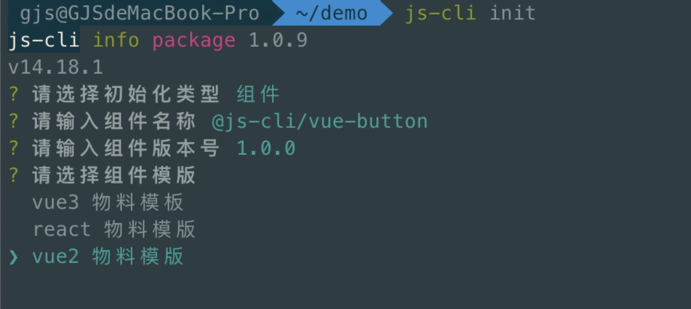
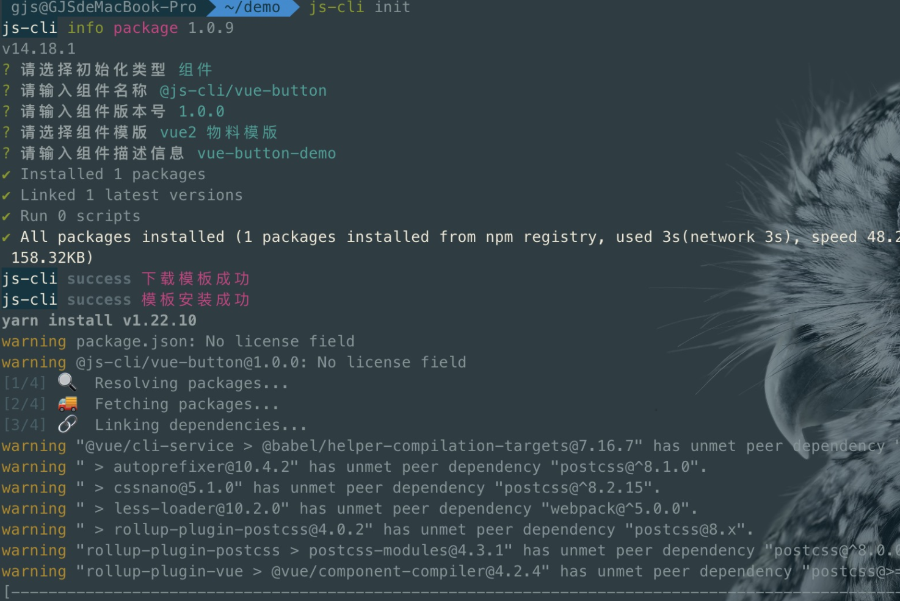
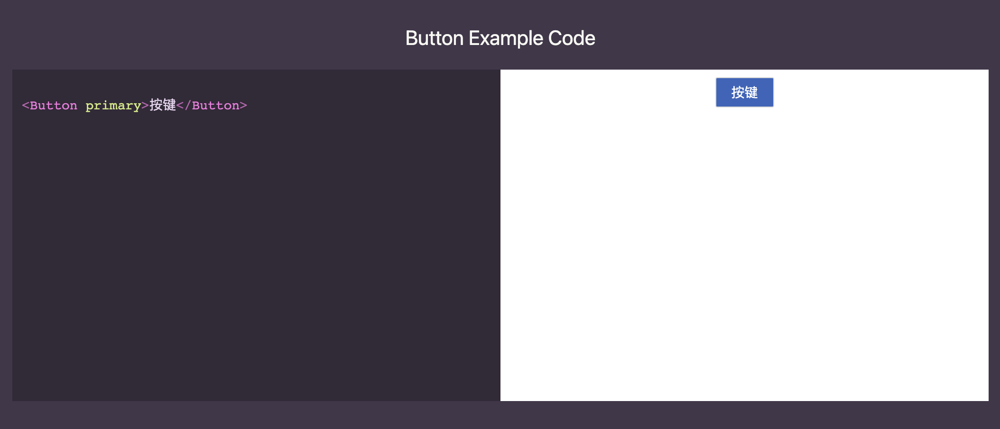
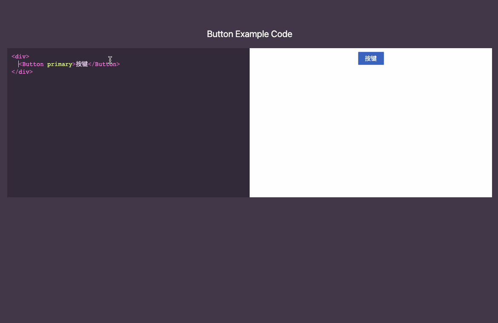
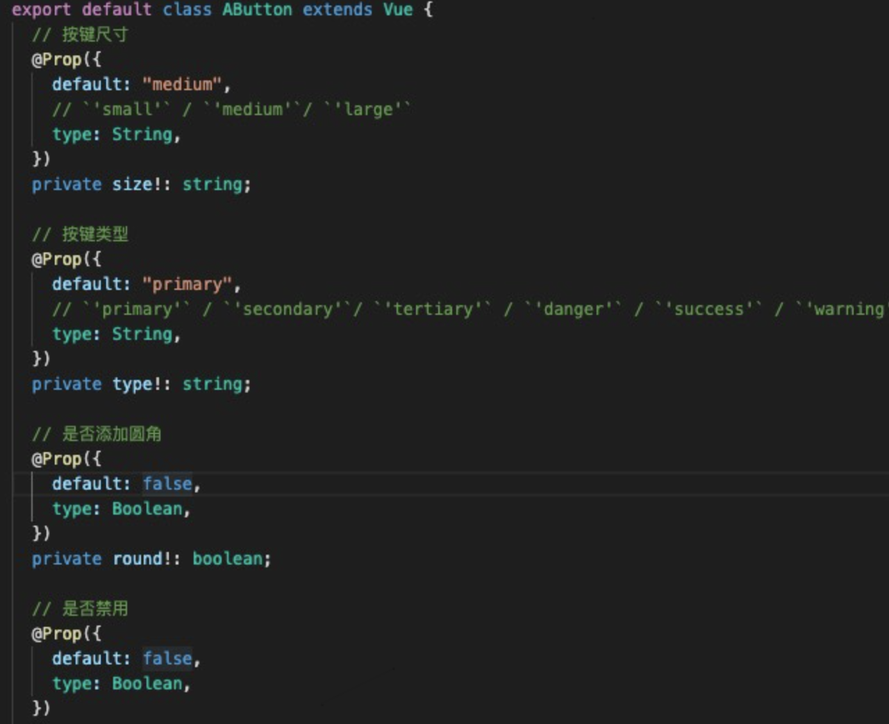
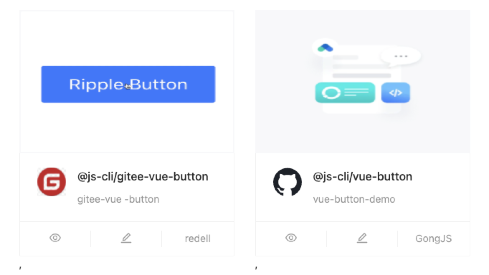
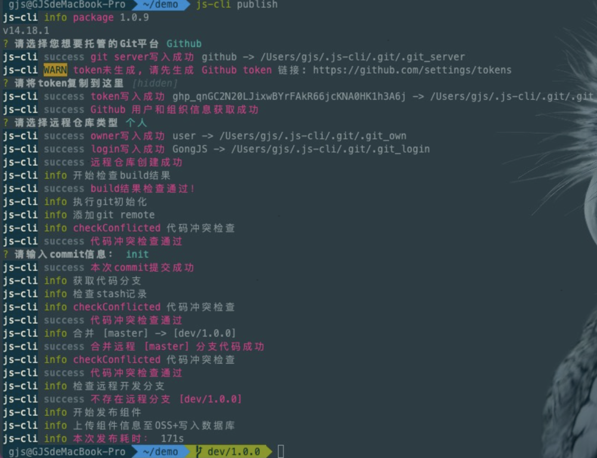
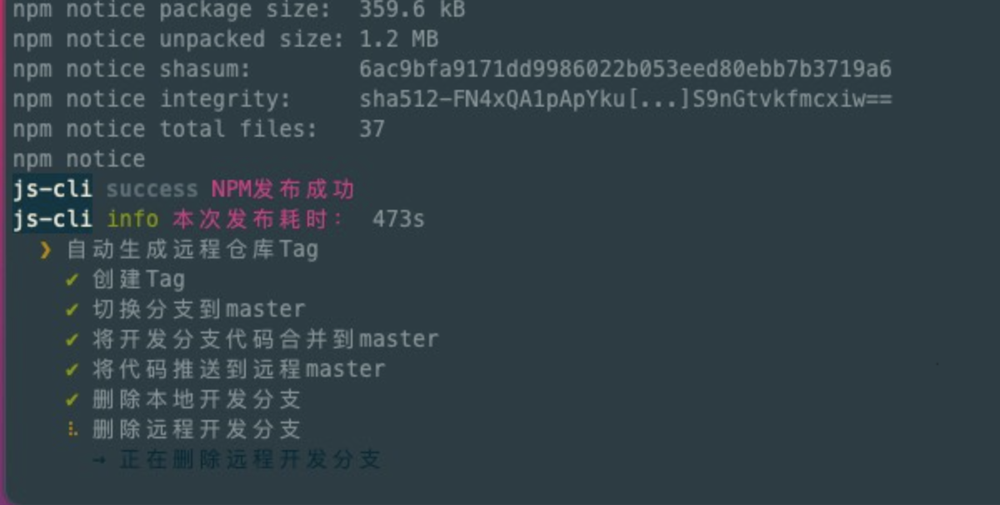

# 物料指南

快速了解 `Agora` 物料概念，创建你的第一个物料。 [Agora物料平台](https://material-platform.ooaaoo.top/)。

> Agora 物料平台 服务于前端技术团队，致力于增强团队协作、促进资源共享、提升开发效率，并提供了简单易学的物料开发方案。

## 何为物料
在中后台项目开发中，我们早已习惯了使用 UI 组件库提升开发效率。基础的 UI 组件库极大降低了界面开发成本，但此类组件通常都是一些与业务逻辑完全解耦的原子组件，不能完全满足复杂的业务场景。

实际项目中包含了大量的可以复用的业务逻辑强耦合的模块，例如站点导航条、员工选择器。如何在团队内部最大程度复用基础业务模块以提升效率、降低冗余？物料的概念就是为了解决这一问题，将基础业务模块从项目之中抽离，统一维护，它们便可以被称为「物料」。
> 摘自 `ArcoDesign`
## 物料分类
在 Agora 的物料体系中，我们将物料细分为了三个种类：组件、区块、页面。

### 组件
组件的概念与 Agora 提供的基础组件最为接近，它们是页面的基础元素构成，但是可能与业务逻辑产生了耦合。使用方式与组件库保持一致，通过引入 NPM 依赖来引用组件。

### 区块
区块相比组件更为复杂，可以理解为多个组件的集合。一个页面通常由若干个区块组成，开发者可以将区块添加到自己的页面进行二次开发。由于区块的复杂性和二次开发的需求存在，区块使用方式与组件不同，本质上是将区块的源码直接下载到本地项目之中。

### 页面
页面即其字面意思，使用方式与区块类似。
## js-cli
为了方便开发者快速搭建物料项目、管理使用物料。Agora 提供了基于 Node 的脚手架工具 `js-cli`，它大致包含了以下的功能：

- 根据模板创建基于 Agora 的物料项目；
- 发布、管理、使用物料；
- 在项目中使用物料区块或者页面；
在开始进一步的流程体验之前，你需要通过 `npm i @js-cli/core -g` 全局安装 `js-cli`。

## 添加物料
运行 `js-cli init` 添加我们的第一个物料，这里需要回答几个关于物料信息的问题。

   
</img-wrapper>

这里我们选择「vue2 模版」，等待物料初始化完成。

   
</img-wrapper>

## 开发物料
运行 `yarn dev` 来开发预览物料。

   
</img-wrapper>

## 代码开发
所有的物料项目都默认采用了 `TypeScript` 进行开发，在物料开发中我们建议遵循以下约束：

- 提供详细的 API 说明；
- 遵循 semver 版本规范，避免主版本内的破坏式更新；
- 面向所有用户的物料尽量避免与业务逻辑耦合，避免接口调用；
- 尽量避免使用 CSS Modules。如果无法确定用户的技术选型，请保证你开发的物料不会导致意料之外的开发环境错误；

## Demo书写
请为你的物料提供尽可能详细的用法示例。

Demo 的书写位置位于 `example` 目录下。此目录下的内容会单独打包部署，作为物料的在线预览地址,使用者可在线编辑代码并实时预览效果。

   
</img-wrapper>

## 物料文档
遵循注释即文档的原则，在编写代码时，把对应的注释也补充完整。运行 `yarn build:doc` 生成文档。

   
</img-wrapper>

## 物料封面图
在根目录`cover-image`文件夹里放置名称为`coverImage.png`的图片，展示效果如下：

   
</img-wrapper>
左边为用户上传的封面图，右边为物料平台默认的展示图。

## 构建
运行 `yarn build` 进行打包构建，生成的产物有:

- `dist` 物料源码
- `example/dist` 物料预览网站源码
- `README.md` 说明文档

## 物料发布
在根目录下运行 `js-cli publish --prod` 发布物料，如果是第一次发布需要填写一些发布信息。

   
</img-wrapper>
发布过程中，若远程仓库不存在，则会自动创建，并根据当前版本号创建开发分支。
发布结束后，会给本次发布内容打上对应的 `tag`, 删除远程开发分支和本地开发分支。

   
</img-wrapper>

> 注意，在发布到 `npm` 请确保已经使用 `npm login` 登录过 npm。
> `--prod` 表示将物料发布到 `npm`，若不加此参数，则只发布到物料平台。e

