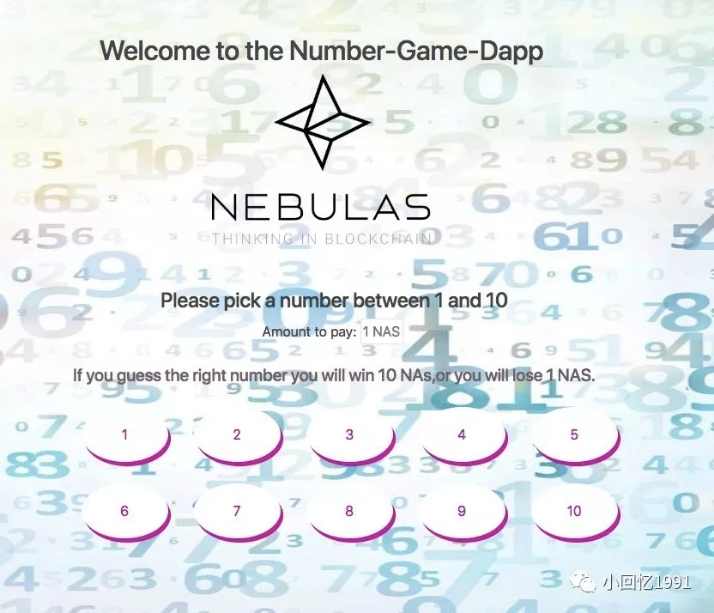

# 项目介绍vue-antd 后台管理系

## vue-antd 后台管理系统

基于Vue和koa2做的一个单车管理系统，实现账号加密登录登出、table数据增删改查、echarts表格百度地图引用等功能。
- 技术栈:  vue+koa2+mysql+antd+vuex+vue-router+腾讯云
- [项目预览](http://132.232.73.32:3000/#/home)
- [github](https://github.com/GongJS/vue-antd-management)
- 体验账号: redell 密码：123

## 图书馆小程序

基于mpvue和知晓云做的一个图书馆小程序，实现了图书的扫码添加(调用豆瓣API)、图书查找、收藏、删除、分类等功能。
- 技术栈:  mpvuex+vuex+知晓云
- [github](https://github.com/GongJS/mpvue-library)
- 小程序码

## token小站
用vue+Eth搭建的一个可以自助发行以太坊代币的网站，同时支持PC端和移动端(建议在PC端使用)

- 技术栈: vue+element+以太坊
- [项目预览](https://gongjs.github.io/token/#/)
- [github](https://github.com/GongJS/tokenSource)

## Nebulas-game-dapp
用星云链搭建的一个去中心化猜数字的dapp，获得星云链官网的新Dapp奖。

- 技术栈: Nebulas+Js
- [项目预览](https://gongjs.github.io/Nebulas-game-dapp/)
- [github](https://github.com/GongJS/Nebulas-game-dapp)

