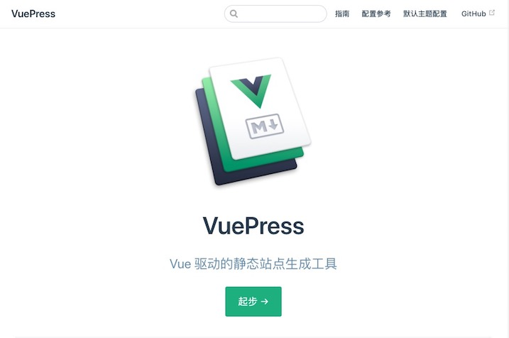
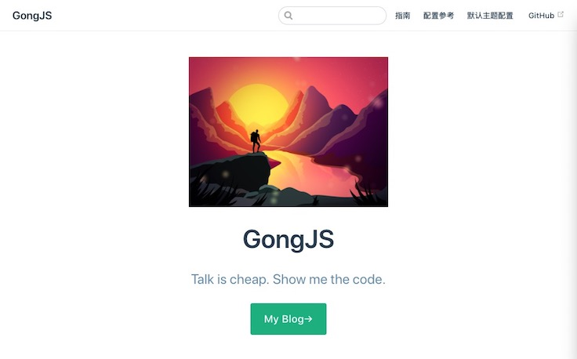

# 手摸手教你用VuePress打造个人Blog

VuePress是以Vue驱动的静态网站生成器，是一个由[Vue](http://vuejs.org/)、[Vue Router](https://github.com/vuejs/vue-router) 和 [webpack](http://webpack.js.org/)驱动的单页应用。在VuePress中，你可以使用Markdown编写文档，然后生成网页，每一个由VuePress生成的页面都带有预渲染好的HTML，也因此具有非常好的加载性能和搜索引擎优化。同时，一旦页面被加载，Vue将接管这些静态内容，并将其转换成一个完整的单页应用，其他的页面则会只在用户浏览到的时候才按需加载。

详情请看[VuePress中文网](http://caibaojian.com/vuepress/)

## 快速开始
```
# 安装
npm install -g vuepress yarn  //安装vuepress和yarn

# 拷贝
git clone git@github.com:docschina/vuepress.git  //这是官方github上的一个Demo,这样省的花时间重新构造项目

# 启动
cd vuepress    //进入项目根目录
yarn           //安装依赖
yarn dev       //启动服务
```
当终端出现
`VuePress dev server listening at http://localhost:8080/`

说明项目已经正常启动，在网页地址栏输入`http://localhost:8080/`就能预览博客了:



## 项目结构分析

我们主要关注`docs`文件夹里的内容，其他文件夹暂时不用修改，`docs`目录结构如下:

```
.
├── .vuepress
│   ├── components  //公用组件
│   ├── config.js   //基础配置文件，也是我们主要修改的文件
│   └── public      //静态资源(图片)
├── config
│   └── README.md          //基础配置文件配置说明，可删除(英文说明)
├── default-theme-config
│   └── README.md          //默认主题配置说明，可删除(英文说明)
├── guide                  //文档指南内的内容，可删除替换成自己的Blog内容(英文)
│   ├── README.md
│   ├── assets.md
│   ├── basic-config.md
│   ├── custom-themes.md
│   ├── deploy.md
│   ├── getting-started.md
│   ├── i18n.md
│   ├── markdown.md
│   └── using-vue.md
├── zh                      //中文配置说明
|   ├── README.md           //首页配置文件
│   ├── config
│   ├── default-theme-config
│   └── guide
└── README.md               //首页配置文件

```
`docs`文件夹里包含了配置文件和说明文档，其中英文说明文档在根目录下，包括`config`、`default-theme-config`,这两个文件跟`zh`文件夹内的`config`、`default-theme-config`是一样的。因为我们不考虑做双语Blog(英文和中文)，所以可以把根目录下的`config`、`default-theme-config`、`guide`这三个文件用`zh`文件夹里面相同的三个文件夹替换,再把`zh`文件夹及文件夹内的`README.md`一起删掉，调整完后的项目结构如下：
```
.
├── .vuepress
│   ├── components        //公用组件
│   ├── config.js         //基础配置文件，也是我们主要修改的文件
│   └── public            //静态资源(图片)
├── config
│   └── README.md            //基础配置文件配置说明，可删除(中文说明)
├── default-theme-config     //默认主题配置说明，可删除(中文说明)
│   └── README.md
├── guide                    //文档指南内的内容，可删除替换成自己的Blog内容(中文)
│    ├── README.md
│    ├── assets.md
│    ├── basic-config.md
│    ├── custom-themes.md
│    ├── deploy.md
│    ├── getting-started.md
│    ├── i18n.md
│    ├── markdown.md
│    └── using-vue.md
├── README.md                 //首页配置文件
```

## 基本配置
打开`.vuepress`目录下的`config.js`文件,这个文件主要配置包括网站的标题、描述等基本信息，以及主题的配置;下面简单的列举一下常用配置:

### Blog信息配置
``` js
 dest: 'vuepress',          //运行yarn build命令后打包生成文件的地址，这里会在项目的根目录下生成一个vuepress的文件夹
  locales: {                //多语言配置，我们这里配置成只使用中文
    '/': {
      lang: 'zh-CN',        //Blog语言
      title: 'GongJS',      //Blog标题
      description: 'Talk is cheap. Show me the code.'  //Blog描述，会在首页展示出来,这里我换成了linus大神的名言，提升一下Blog的逼格，嘿嘿嘿～～～
    }
  },
    head: [                 //额外的需要被注入到当前页面的 HTML <head> 中的标签
    ['link', { rel: 'icon', href: `/logo.png` }],
    ['link', { rel: 'manifest', href: '/manifest.json' }],
    ['meta', { name: 'theme-color', content: '#3eaf7c' }],
    ['meta', { name: 'apple-mobile-web-app-capable', content: 'yes' }],
    ['meta', { name: 'apple-mobile-web-app-status-bar-style', content: 'black' }],
    ['link', { rel: 'apple-touch-icon', href: `/icons/apple-touch-icon-152x152.png` }],
    ['link', { rel: 'mask-icon', href: '/icons/safari-pinned-tab.svg', color: '#3eaf7c' }],
    ['meta', { name: 'msapplication-TileImage', content: '/icons/msapplication-icon-144x144.png' }],
    ['meta', { name: 'msapplication-TileColor', content: '#000000' }]
  ],
```
更多具体掉配置详情请看文档：[配置](https://vuepress.vuejs.org/zh/config/#configurewebpack/)

### PWA配置
VuePress默认支持PWA配置的，需要在基本配置中开启serviceWorker。
``` js
serviceWorker: true,
```
然后配合`public`里面的的`manifest.json`配置和`icons`图标使用。如果不知道pwa,可到[mdn](https://developer.mozilla.org/en-US/docs/Web/Manifest/)了解具体概念。

### 主题配置
以下内容在我们需要自定义主题的时候才需要用到，我们暂时不更改,使用Demo的默认值:

``` js
  theme: 'vue',
  themeConfig: {
    repo: 'gongjs',    //这里换成自己的仓库地址
    editLinks: true,   //文末会生成一个链接，可以跳转到你设置的repo的github仓库
    docsDir: 'docs',
     locales: {        //首页导航栏配置
      '/': {
        nav: [
          {
            text: '指南',
            link: '/guide/',    //Blog指南内的内容
          },
          {
            text: '配置参考',
            link: '/config/'    //基础配置文件配置说明
          },
          {
            text: '默认主题配置',
            link: '/default-theme-config/' //主题配置文件配置说明
          }
        ],
        sidebar: {
          '/guide/': genSidebarConfig('指南')  //侧边栏配置
        }
      }
    },
    //侧边栏配置  guide文件夹内的每一个md文件都对应一个页面
    function genSidebarConfig (title) {
      return [
       {
         title,
         collapsable: false,  //是否可折叠
         children: [          //这里省略了md的扩展名
          '',
          'getting-started',
          'basic-config',
          'assets',
          'markdown',
          'using-vue',
          'custom-themes',
          'i18n',
          'deploy'
        ]
      }
    ]
  }
}
```
更多具体主题配置详情请看文档[主题配置](https://vuepress.vuejs.org/zh/default-theme-config/#%E9%A6%96%E9%A1%B5)

## 首页配置

打开`docs`根目录下的`README.md`文件，从`<div style="text-align: center">`开始，这些内容都可以自己定义，这边为了省事,我把它们全部删除掉，只留下以下内容：
``` md
---
home: true                    //启用首页的默认布局
heroImage: /hero.png          //首页的图片地址，图片完整路径./vuepress/public/hero.png,可替换成自己喜欢的图
actionText: My Blog→          //首页按键的文字，可替换
actionLink: /guide/           //首页按键的跳转路径
---
```
首页效果如下图所示:




## 部署
由于运行`yarn build`命令后生成的是一个静态页面，所以需要将打包生成的`vuepress`文件夹中的内容用服务器托管,才能让整个Blog真正的运行起来。在这里我们选择github来托管我们的Blog。如果使用git上传到github上,操作比较繁琐,这里我们使用脚本的方式自动部署到github上。
这里以我自己的github仓库为例，首先在自己的github上建一个名为`GongJS.github.io`的仓库。

::: tip 提示
`GongJS`是我自己的github用户名，在本教程里，凡是出现`GongJS`都要替换成自己github的用户名。
:::

### 编写脚本
打开项目根目录下的`scripts`文件夹里面的`deploy-gh.sh`文件，并改成如下内容：
``` sh
cd vuepress    //进入到打包后的输出文件夹
git init       //初始化git仓库
git add -A
git commit -m 'deploy'     //提交文件内的所有文件
git push -f git@github.com:GongJS/GongJS.github.io.git master   //代码上传到github里面新建的GongJS.github.io仓库。
```
### 查看结果
脚本保存后，切换到项目根目录下，在终端里输入`yarn deploy-gh`,开始执行脚本命令。
代码提交成功后，这时候输入网址`https://gongjs.github.io`，下面就是见证[奇迹](https://gongjs.github.io)的时刻了.

<RightMenu />